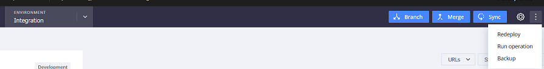

# Backup (instantâneo) na nuvem: Perguntas frequentes

Este artigo aborda o backup de seus ambientes com instantâneos no Adobe Commerce na infraestrutura em nuvem.

## Produtos e versões afetados

* Adobe Commerce na infraestrutura em nuvem 2.4.x
* Planos de arquitetura: Starter, Pro Legacy, Pro

## Instantâneo do ambiente, plano Pro

### Ambientes de preparo e produção

* Os instantâneos manuais não estão disponíveis para ambientes de preparo e produção no plano Pro.
* Instantâneos automáticos são criados **independentemente do estado ativo** do site (instantâneos também criados para sites que ainda não foram iniciados). Os backups automáticos não são acessíveis publicamente, pois são armazenados em um sistema separado. Você pode [enviar um tíquete de suporte da Adobe Commerce](/docs/commerce-knowledge-base/kb/help-center-guide/magento-help-center-user-guide.html#submit-ticket) para solicitar um backup especial ou restaurar a partir de um backup específico, fornecendo a data, a hora e o fuso horário no ticket. Além disso, observe que o suporte não executa a reversão ou restauração do banco de dados para você - eles recuperam o instantâneo, mas você mesmo deve restaurar o banco de dados.
* Os backups são criados usando o **Instantâneos criptografados do Amazon Web Services Elastic Block Store (AWS EBS)**.
* Os snapshots do ambiente incluem o sistema completo (sistema de arquivos e banco de dados).
* Tempo de retenção para snapshots automáticos **é diferente** e segue [a programação](/docs/commerce-cloud-service/user-guide/architecture/pro-architecture.html?lang=en#backup-and-disaster-recovery).

>[!NOTE]
>O Cloud Console sempre mostra [!UICONTROL No backup] em ambientes de preparo e produção. Só é possível fazer backups do ambiente de integração. Selecionar **[!UICONTROL Backup]** no menu suspenso de reticências.
>

### Ambiente de integração (desenvolvimento)

* Seu [Ambiente de integração](/help/announcements/adobe-commerce-announcements/integration-environment-enhancement-request-pro-and-starter.md) é **sem backup automático**, mas é possível criar snapshots **manualmente**.
* Você pode criar snapshots manuais para ambientes de Integração em lojas sem transmissão ao vivo.
* Você pode ter **vários instantâneos** que foram acionados manualmente.
* Um snapshot acionado manualmente é armazenado para **7 dias**.

**Artigos relacionados em nossa documentação para desenvolvedores:**

* [Backup e recuperação de desastres](/docs/commerce-cloud-service/user-guide/architecture/pro-architecture.html#backup-and-disaster-recovery)
* [Criar um instantâneo](/docs/commerce-cloud-service/user-guide/develop/storage/snapshots.html)

## Instantâneo do ambiente, plano inicial

* Todos os tipos de ambientes (integração, preparo, produção) **não estão sendo submetidos a backup automaticamente**, mas é possível criar snapshots manualmente.
* Você pode criar snapshots manuais **independentemente do estado ativo** do site (instantâneos também criados para sites que ainda não foram iniciados).
* Um snapshot acionado manualmente é armazenado para **7 dias**.

## Restaurar um instantâneo do ambiente

Para restaurar um instantâneo existente (no ambiente compatível: Integração, Preparo, Produção no plano Starter ou Integração no plano Pro), siga as etapas em [Gerenciamento de backup: restaurar um backup manual](https://experienceleague.adobe.com/en/docs/commerce-cloud-service/user-guide/develop/storage/snapshots#restore-a-manual-backup) em nosso Guia de infraestrutura do Commerce na nuvem.

## Backup do banco de dados (BD)

O backup de BD faz parte de um instantâneo da nuvem:

>>
Um instantâneo é um backup completo de um ambiente que inclui todos os dados persistentes de todos os serviços em execução (por exemplo, **seu banco de dados MySQL**, Redis e assim por diante) e quaisquer arquivos armazenados nos volumes montados.

>[!NOTE]
>
>Os volumes montados incluem/referem-se apenas a [montagens graváveis](/docs/commerce-cloud-service/user-guide/configure/app/properties/properties.html?lang=en#mounts) e não incluirão todo o diretório /app. Quanto aos outros arquivos, eles são criados/gerados por [o processo de criação e implantação](/docs/commerce-cloud-service/user-guide/architecture/pro-develop-deploy-workflow.html?lang=en#deployment-workflow), e você também terá que fazer check-out dos arquivos restantes do repositório Git.

[Gerenciamento de snapshots e backup](/docs/commerce-cloud-service/user-guide/develop/storage/snapshots.html) na documentação do desenvolvedor.

Enviar somente um [solicitação de suporte](/docs/commerce-knowledge-base/kb/help-center-guide/magento-help-center-user-guide.html?lang=en#submit-ticket) para um instantâneo do banco de dados de produção Pro e preparo, se você precisar do banco de dados de um ponto específico no tempo. Se você precisar de um backup atual apenas do seu banco de dados (em qualquer ambiente), consulte o artigo da base de conhecimento: [Gerar despejos de banco de dados na nuvem](/help/how-to/general/create-database-dump-on-cloud.md).
