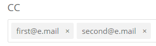

# Guia do usuário da Central de ajuda do Adobe Commerce

Neste guia, saiba como enviar um tíquete de suporte ao [Centro de ajuda do Adobe Commerce](https://support.magento.com/hc/en-us) e fornecer acesso compartilhado às contas do Magento.

>[!NOTE]
>
>A parte da Base de conhecimento do Adobe Commerce Help Center migrou para o portal da Adobe Experience League. Ao criar um tíquete de suporte, serão sugeridos artigos relacionados da Knowledge base, juntamente com outra documentação relevante do Adobe Commerce na Adobe Experience League.

**Atualização principal:** 14 de outubro de 2022

**[O QUE É O CENTRO DE AJUDA DA ADOBE COMMERCE?](#what-is)**

**[TÍQUETES DE SUPORTE](#support-tickets)**

* [Fazer Logon Na Central De Ajuda](#login)
* [Enviar um tíquete de suporte](#submit-ticket)

   * [Página inicial da Central de ajuda](#submit-ticket-help-center-start-page)
   * [Página da conta do Magento](#submit-ticket-magento-account-page)
   * [Cloud Console](#submit-ticket-magento-cloud-account-page)
   * [Informações no tíquete de suporte](#info-in-support-ticket)
   * [O link &quot;Enviar um tíquete&quot; não é exibido na página inicial da Central de ajuda da Adobe Commerce](#no-submit-link)
   * [*&quot;Verifique seu endereço de email&quot;*](#verify-email-address)
   * [Formulário de envio de tíquete: o comerciante não é exibido no menu suspenso Organização](#merchant-not-displayed)

* [Acompanhe seus ingressos](#track-tickets)
* [Linha direta Adobe Commerce P1 (logon necessário)](#P1-hotline)
* [Modelo operacional de responsabilidade compartilhada da Adobe Commerce (logon necessário)](#shared-responsibility-operational-model)
* [Explicação dos campos de tíquete de suporte](#ticket-fields-explained)
* [Status do tíquete: como suas solicitações são processadas](#ticket-status)
* [Conversa no seu tíquete](#conversation-in-ticket)
* [Resolver seu tíquete](#resolve-ticket)
* [Abrir um tíquete de acompanhamento](#follow-up)

**[ACESSO COMPARTILHADO: CONCEDER PRIVILÉGIOS PARA QUE OUTROS USUÁRIOS ACESSEM SUA CONTA](#shared-access)**

* [Quem pode fornecer acesso compartilhado](#who-can-provide-shared-access)
* [Fornecer acesso compartilhado](#provide-shared-access)
* [Revogar (excluir) o acesso compartilhado](#revoke-shared-access)

   * [Como excluir usuários que receberam acesso compartilhado por meio de um projeto na nuvem?](#remove-cloud-shared-access-users)

* [Acessar conta compartilhada (alternar contas)](#switch-accounts)
* [Solução de problemas de acesso compartilhado](#troubleshooting-shared-access)

**[PERGUNTAS FREQUENTES SOBRE FATURAMENTO DO ADOBE COMMERCE](#billing-faq)**

**[A MAGENTO U AGORA FAZ PARTE DO ADOBE DIGITAL LEARNING SERVICES](#magento-u)**

## O QUE É O CENTRO DE AJUDA DA ADOBE COMMERCE? {#what-is}

A variável [Centro de ajuda do Adobe Commerce](https://support.magento.com/hc/en-us) O é um portal de suporte do Adobe Commerce, onde os clientes qualificados podem enviar e gerenciar tíquetes de suporte. Também é onde você pode consultar os artigos de solução de problemas.

## TÍQUETES DE SUPORTE {#support-tickets}

O Adobe Commerce Ticketing System permite trabalhar com tíquetes de suporte para solucionar problemas específicos que você está enfrentando ao trabalhar com o Adobe Commerce - para todos os produtos da Adobe Commerce.

## FAÇA LOGON NA CENTRAL DE AJUDA {#login}

Fazer logon permite enviar, atualizar e responder às perguntas dos agentes sobre tíquetes de suporte.

Para fazer logon na Central de ajuda do Adobe Commerce, siga estas etapas:

1. Acesse a Central de ajuda em <https://support.magento.com>.
1. Clique em **Fazer logon** no canto superior direito.

Use as credenciais da sua conta Magento para fazer logon. Para obter mais informações, consulte [Sua conta Magento](https://experienceleague.adobe.com/docs/commerce-admin/start/commerce-account/commerce-account-create.html) em nosso guia do usuário.

### <strong>Enviar um tíquete de suporte</strong> {#submit-ticket}

Depois de fazer logon, você pode enviar um tíquete de suporte usando a página inicial da Central de ajuda, a página Conta de Magento e a página Conta da nuvem de Magento.

* Se você for o **Proprietário da conta** siga as etapas abaixo.
* Se você é um **Usuário de Acesso Compartilhado, você deve trocar de conta primeiro** [Acessar conta compartilhada (alternar contas)](#switch-accounts)e então você pode prosseguir para as etapas abaixo.

#### Página inicial da Central de ajuda {#submit-ticket-help-center-start-page}

Para enviar um novo tíquete de suporte usando a página inicial da Central de ajuda do Adobe Commerce, siga estas etapas:

1. Ir para [Centro de ajuda do Adobe Commerce](https://support.magento.com/hc/en-us).
1. Clique em **Enviar um tíquete** no canto superior direito.

   {width="800"}

1. Preencha os campos.
1. Clique em **Enviar**.

Você **deve fazer logon** à Central de ajuda usando sua conta Magento para enviar um tíquete de suporte. Até você estar conectado, [o **Enviar um tíquete** O botão não será exibido](#no-submit-link).

#### Página da conta do Magento {#submit-ticket-magento-account-page}

Para enviar um novo tíquete de suporte usando a página Conta do Magento, siga estas etapas:

1. Faça logon em sua conta Magento. Consulte [instruções detalhadas](https://experienceleague.adobe.com/docs/commerce-admin/start/commerce-account/commerce-account-create.html?lang=en#create-a-commerce-account) em nosso guia do usuário.
1. Clique em **Suporte** guia.

   {width="800"}

1. A página inicial da Central de ajuda é carregada para você.
1. Clique em **Enviar um tíquete** no canto superior direito.
1. Preencha os campos.
1. Clique em **Enviar**.

#### Cloud Console {#submit-ticket-magento-cloud-account-page}

Para enviar um novo tíquete de suporte usando o Cloud Console, siga estas etapas:

1. Faça logon no [Cloud Console](https://console.adobecommerce.com).
1. Selecionar **[!UICONTROL Support]** no menu do usuário.
1. A variável **[!UICONTROL My Tickets]** A página é carregada.
1. Clique em **[!UICONTROL Submit a ticket]** no canto superior direito.
1. Preencha os campos.
1. Clique em **Enviar**.
1. Clique em **[!UICONTROL Submit]**.

#### Informações no tíquete de suporte {#info-in-support-ticket}

Os campos, marcados com um asterisco vermelho ( **\*** ), são obrigatórios e devem ser preenchidos. Se você deixar qualquer um desses campos vazios, não poderá enviar o tíquete.

Consulte [Campos de tíquete explicados](#ticket-fields-explained) abaixo para obter informações mais detalhadas.

### O link &quot;Enviar um tíquete&quot; não é exibido na página inicial da Central de ajuda da Adobe Commerce {#no-submit-link}

#### Problema

Você acessa a Central de ajuda da Adobe Commerce e deseja enviar uma solicitação de suporte, mas a **Enviar um tíquete** O link não é exibido na página inicial da Central de ajuda.

#### Causa

Um dos seguintes pode ser a causa:

* Você não fez logon na Central de ajuda.
* Se estiver usando o acesso compartilhado pela primeira vez, você não executou as etapas necessárias para garantir que a Central de ajuda do Adobe Commerce esteja configurada corretamente por meio da chamada SSO de Magento.com.
* Sua conta não tem direito ao suporte da Adobe Commerce (por exemplo, você não é um cliente do Commerce pagante ou é um cliente de Código aberto).

#### Solução

[Fazer logon na Central de ajuda](/help/help-center-guide/help-center/magento-help-center-user-guide.md#provide-shared-access).

A variável **Enviar um tíquete** O link só será exibido para clientes com um email vinculado a um contrato de suporte válido.

#### Uso da conta de acesso compartilhado

Para poder usar a conta de acesso compartilhado para enviar tíquetes de suporte, é necessário executar o seguinte (isso precisa ser feito apenas uma vez):

1. Depois de receber [acesso compartilhado](https://support.magento.com/hc/en-us/articles/360052444712#who-can-provide-shared-access), faça logon no [Conta Magento no site magento.com](https://account.magento.com/).
1. No **Trocar contas** no canto superior direito, selecione a conta de acesso compartilhado
1. Clique no link **Suporte** no painel esquerdo. Isso garantirá que a Central de ajuda do Adobe Commerce seja configurada corretamente por meio da chamada SSO de Magento.com para a Central de ajuda do Adobe Commerce.

#### Ainda não está vendo o **Enviar um tíquete** link

Se você não tiver **Contas compartilhadas** no **Trocar contas** lista suspensa, mas você estiver trabalhando para um cliente que tenha uma licença do Adobe Commerce, peça a ele para conceder acesso compartilhado. Para obter mais detalhes, consulte [Fornecer acesso compartilhado à conta do Magento](/help/help-center-guide/help-center/magento-help-center-user-guide.md#provide-shared-access).

Se você for um proprietário de licença da Adobe Commerce, verifique se não tem uma fatura com **Pagamento pendente** status. Os direitos de suporte são automaticamente concedidos ou revogados de acordo com o status de pagamento da fatura.

Como Verificar Seu Status De Pagamento:

1. Efetue logon no [magento.com](https://support.magento.com/).
1. Clique em **Histórico de Cobrança** à esquerda.
1. Se você **fazer** ter uma fatura com **Pagamento pendente** status, **entre em contato com a equipe de conta do Adobe** para que a questão do pagamento seja resolvida.

Fornecemos suporte somente aos proprietários de licença da Adobe Commerce e contas que têm Acesso compartilhado a uma conta com uma licença da Adobe Commerce. Se precisar de suporte para a edição Magento Open Source, utilize estes recursos técnicos de autoajuda:

* [Centro de ajuda do Adobe Commerce](https://support.magento.com/)
* [Documentação do desenvolvedor do Adobe Commerce](https://developer.adobe.com/commerce/docs/)
* [Recursos de documentação do Adobe Commerce](https://experienceleague.adobe.com/docs/commerce.html)
* [Fóruns do Magento](https://community.magento.com/?_ga=2.99592990.1084044056.1559046120-720752292.1551793747)

Se tiver problemas ao fazer logon em sua conta ou acreditar que o Acesso compartilhado foi configurado corretamente, mas ainda não conseguir ver **Enviar um tíquete** botão, envie um email para [Problemas de logon na Central de ajuda](mailto:grp-magento-helpcenterloginissues@adobe.com)e analisaremos com prazer as configurações da sua conta e os direitos de suporte.

>[!NOTE]
>
>Não envie um email caso você consiga enviar um tíquete, mas tenha um problema ao acessar seu projeto na nuvem. Envie o tíquete para esse problema pelos canais regulares.

### Erro &quot;Verifique seu endereço de email&quot; na página da conta do Magento {#verify-email-address}

Você não poderá enviar um tíquete de suporte se receber o *Verifique seu endereço de email* erro semelhante ao abaixo no [Página da conta do Magento](https://account.magento.com/).

{width="800"}

A solução é validar seu endereço de email:

1. Clique no link **Validar email** abaixo do campo E-mail no campo [Editar informações da conta](https://account.magento.com/customer/account/edit/) semelhante à página abaixo.

   {width="800"}

1. Clicar no **Validar email** O botão enviará um email para o endereço de email registrado nessa conta do Magento com um link para validar o endereço de email.
1. Clique no link de validação de email para validar seu email e resolver esse problema.
1. Se você não receber um email com um link de validação, envie um email para [Problemas de logon na Central de ajuda](mailto:grp-magento-helpcenterloginissues@adobe.com) e indique que não é possível validar seu endereço de email.

>[!NOTE]
>
>Isso se aplica somente ao link de validação de email de https://account.magento.com (página Conta do Magento).

### Formulário de envio de tíquete: o comerciante não é exibido no menu suspenso Organização {#merchant-not-displayed}

#### Problema

Pré-requisitos: você tem uma conta de acesso compartilhado concedida por um comerciante.

Etapas a serem reproduzidas:

1. Faça logon na Central de ajuda usando sua conta compartilhada.
1. Clique em **Enviar um tíquete** link. O formulário de envio de tíquete é aberto.
1. Expanda a **Organização** para selecionar o comerciante.

Resultado esperado:

O comerciante correspondente à conta compartilhada está listado no **Organização** opções.

Resultado real:

O comerciante correspondente à conta compartilhada usada não está disponível na **Organização** opções.

#### Solução

Depois de receber acesso compartilhado do comerciante, é necessário executar as seguintes etapas (apenas uma vez):

1. Faça logon no [Conta Magento no site magento.com](https://account.magento.com/).
1. No **Trocar contas** no canto superior direito, selecione a conta de acesso compartilhado
1. Clique no link **Suporte** no painel esquerdo. Isso garantirá que a Central de ajuda do Adobe Commerce seja configurada corretamente por meio da chamada SSO de Magento.com para a Central de ajuda do Adobe Commerce.

### Acompanhe seus ingressos {#track-tickets}

Seus ingressos são aqueles que você:

* submeteu pessoalmente
* foram adicionados ao como observador por meio de uma CC (cópia carbono)

#### Exibir seus tíquetes

Para listar todos os tíquetes, clique no menu de perfil (canto superior direito) na página inicial da Central de ajuda e selecione **Meus ingressos**.

{width-&quot;800&quot;}

Para alternar entre seus tíquetes e os tíquetes ativados por CC, clique na guia correspondente:

* **Meus ingressos**
* **Ingressos com CC**
* **Tíquetes da organização** (disponível se sua conta estiver associada a várias organizações)

Para classificar tíquetes, clique em **Criado em** ou **Última atividade** cabeçalhos de coluna.

#### Pesquisar tíquetes

Para localizar tíquetes, digite a consulta de pesquisa no campo **Pesquisar tíquetes** e pressione *Enter* no teclado. Selecionar [um status](#ticket-status) para filtragem adicional.

#### Seguir tíquetes da organização

Você pode seguir os tíquetes de suporte enviados pelos membros de sua organização.

Ao seguir os tíquetes da organização, você:

* pode exibir tíquetes na **Tíquetes da organização** guia
* receber notificações por email quando os novos tíquetes forem enviados ou quando os tíquetes existentes forem alterados

Para seguir/deixar de seguir tickets de uma organização:

1. Ir para **Meus ingressos** > **Tíquetes da organização** guia.
1. Selecione uma organização no menu e clique em **Seguir/Deixar de seguir**.

### Linha direta Adobe Commerce P1 {#P1-hotline}

**O logon é obrigatório** para acessar o [Linha direta Adobe Commerce P1](https://experienceleague.adobe.com/docs/commerce-knowledge-base/kb/how-to/adobe-commerce-p1-notification-hotline.html) artigo que fornece os números de linha direta P1 do Adobe Commerce ao buscar ajuda durante um incidente P1 e explica quais informações fornecer.

### Modelo operacional de responsabilidade compartilhada da Adobe Commerce {#shared-responsibility-operational-model}

**O logon é obrigatório** para acessar o [Modelo operacional de responsabilidade compartilhada da Adobe Commerce](https://support.magento.com/hc/en-us/articles/4407700678669) artigo que tem como objetivo esclarecer as responsabilidades operacionais em torno da Adobe Commerce somente em nossa oferta de infraestrutura profissional.

### Explicação dos campos de tíquete de suporte {#ticket-fields-explained}

#### URL afetado

Link para o ambiente em que a equipe de suporte da Adobe Commerce poderá ver o problema. Inicie o URL com &quot;http://&quot; ou &quot;https://&quot;.

#### Anexos

Anexe logs, capturas de tela, gravações de vídeo ou qualquer outra mídia que possa ilustrar melhor seu problema.

#### URL do Backoffice (somente MOM)

O URL deve começar com &quot;https://&quot;. Normalmente, ela estará no formato: nome do comerciante +&quot;.mcom.magento.com/admin/login&quot;, por exemplo, &quot;https://luma.mcom.magento.com/admin/login&quot;.

Você também pode colocar o link direto relacionado ao seu problema.

#### CC

Emails das pessoas que você deseja seguir seu ticket (por exemplo, *first@e.mail*).

Você pode adicionar emails das pessoas que não têm uma conta Magento ou uma conta Zendesk; essas pessoas ainda são capazes de contribuir para a conversa em seu ticket.

Para adicionar vários emails ao CC:

>[!NOTE]
>
>O usuário em CC: deve ter uma conta existente em https://account.magento.com. Caso contrário, eles devem primeiro criar um em https://account.adobe.com e fazer logon em https://account.magento.com com essa conta.

1. Insira o email.
1. Pressione *Espaço* no teclado para salvar o email inserido. O email aparece em um quadro cinza.\
   
1. Comece a digitar o próximo email.
1. Salve todos os outros emails pressionando *Espaço*.

Para excluir emails do CC: clique em **x** em um email enquadrado.

#### Produto

Selecione o tipo de produto Adobe Commerce com o qual você está trabalhando:

* Adobe Commerce: o **[!UICONTROL Implementation Type]** aparecerá após selecionar essa opção (veja abaixo os detalhes)
* Magento Order Management
* Relatórios do Adobe Commerce: sem incluir [Relatórios avançados](https://experienceleague.adobe.com/docs/commerce-admin/config/general/advanced-reporting.html)
* Adobe Commerce [Payment Services](https://experienceleague.adobe.com/docs/commerce-merchant-services/payment-services/overview.html)
* Serviços da Adobe Commerce: [Gerenciador de canais](https://experienceleague.adobe.com/docs/commerce-channels/channel-manager/guide-overview.html) somente

#### Tipo de implementação

Este campo só aparecerá depois que você selecionar **[!UICONTROL Product]** = *Adobe Commerce*

Especifique seu método de implantação:

* Nuvem: escolha essa opção somente se você estiver no Adobe Commerce na infraestrutura em nuvem
* No local: *Todas as instâncias auto-hospedadas e [AWS] hospedagem baseada em nuvem* (exclui Adobe Commerce na nuvem)

#### URL do projeto na nuvem

Forneça o URL para o projeto do Cloud Console, por exemplo, `https://console.adobecommerce.com/<owner-user-name>/<project-ID>`.

Outro método para obter o URL do projeto é o seguinte:

1. Faça logon no [Cloud Console](https://console.adobecommerce.com).
1. Clique no projeto apropriado.
1. Copie o URL.

#### Motivo do contato

Os motivos de contato variam por produto. Escolha qual razão de contato se adapta melhor aos sintomas que você está enfrentando. Consulte a [Tíquete de suporte Descrições do motivo de contato](/help/faq/general/support-ticket-contact-reason-descriptions.md) artigo para saber mais sobre a razão do contato que você deve escolher.

#### ID de ambiente do Adobe Commerce

Este campo só aparecerá depois que você selecionar **[!UICONTROL Contact Reason]** = *Aplicativo Adobe Commerce Cloud*, seguido por **Motivo do contato do aplicativo Adobe Commerce** = *[!DNL Live Search]*.
Ir para **[!UICONTROL System]** > **[!UICONTROL Services]** > **[!UICONTROL Commerce Services Connector]** > **[!UICONTROL SaaS Identifier]** e fornecer a *[!UICONTROL Data Space ID]*.

#### (Dados) Tipo de integração (somente Relatórios do Adobe Commerce)

Selecione o tipo de integração que você tem nos Relatórios do Adobe Commerce. Isso ajudará nossos engenheiros a resolver seu problema com mais eficiência.

#### Descrição

Inclua uma visão geral do seu problema com quantos detalhes você achar razoavelmente possíveis.

Forneça detalhes precisos e etapas para reproduzir (exceto para Adobe Commerce no local e infraestrutura em nuvem, onde há uma [Etapas a serem reproduzidas](#steps) e sintomas de seu problema ou solicitação. Certifique-se de incluir SKUs afetadas, pontos de dados relevantes e quaisquer outros links relevantes.

#### Ambiente (Adobe Commerce na infraestrutura em nuvem, Adobe Commerce no local, somente Relatórios e Envio do Adobe Commerce)

Selecione o **tipo de ambiente** em que você enfrenta o problema:

* Desenvolvimento (**Ramificações de integração**)
* Estágios
* Produção

Leia mais sobre a Adobe Commerce em ambientes de infraestrutura em nuvem no [Arquitetura Pro](https://experienceleague.adobe.com/docs/commerce-cloud-service/user-guide/architecture/pro-architecture.html) em nosso guia do usuário.

#### Número de pedidos afetados (somente MOM)

Selecione o intervalo de ordens afetadas.

Essa é uma lista suspensa e aplicável somente ao produto Order Management.

#### Organização

Indique a organização à qual você deseja que seu ticket seja associado, caso trabalhe com várias organizações.

Esse campo aparece quando sua conta está associada a mais de uma organização.

>[!WARNING]
>
>Você deve garantir que selecionou a organização correta. Um terceiro que não esteja relacionado à organização poderá exibir informações potencialmente confidenciais e proprietárias, se você selecionar a organização errada.

>[!NOTE]
>
>A organização pode ser alterada após o envio do tíquete. Siga estas etapas para alterar a organização.
>
>1. Vá para a coluna direita do ticket.
>1. Localize a lista suspensa de organizações disponíveis.
>1. Selecione a organização apropriada.
>
>

Além disso, isso permitiria cruzar rapidamente a referência de tickets semelhantes/duplicados/relacionados enviados para essa organização no passado e identificar pistas que poderiam ajudar na investigação e resolução do ticket atual.

Se você tiver Acesso compartilhado a várias organizações, mas esse campo não estiver disponível, consulte [Formulário de envio de tíquete: o comerciante não é exibido no menu suspenso Organização](https://experienceleague.adobe.com/docs/commerce-knowledge-base/kb/help-center-guide/magento-help-center-user-guide.html#merchant-not-displayed)

#### Nome do parceiro (nome do comerciante)

Para comerciantes: **Nome do parceiro** é o nome da Organização de desenvolvimento (Adobe Commerce [Parceiro de tecnologia](https://partners.magento.com/portal/directory/?&amp;partner_type=6) ou [Parceiro de soluções](https://partners.magento.com/portal/directory/?&amp;partner_type=1)) que participam do desenvolvimento da loja da Adobe Commerce.

Para parceiros: **Nome do comerciante** é o nome do seu Cliente.

#### URL do projeto (somente Commerce Cloud)

Link para o [Cloud Console](https://experienceleague.adobe.com/docs/commerce-cloud-service/user-guide/project/overview.html).

#### Etapas para reproduzir (Adobe Commerce no local e Adobe Commerce somente na infraestrutura em nuvem)

Forneça instruções passo a passo exatas para reproduzir o problema, incluindo:

* Etapas para replicar
* Resultado esperado
* Resultado real

*Recomendação:* Suponha que você esteja escrevendo essas etapas para alguém que saiba **nada** sobre o Adobe Commerce:

* Mencione cada etapa, mesmo que pareça simples e óbvia
* Não confie na suposição de que seu leitor sabe o que significa

Escreva em linguagem simples, com frases curtas.

#### Assunto

Inclua uma breve visão geral do seu problema (por exemplo, *Erro 404 em todas as páginas* ).

**Artigos sugeridos:** Quando você insere o termo de pesquisa, é exibida uma lista de artigos da Documentação do Adobe Comércio que podem estar relacionados ao seu problema. Clique em um artigo na lista para abri-lo.

*Recomendação:* Considere com cuidado os artigos propostos. Eles podem conter a solução que você espera receber da equipe de suporte da Adobe Commerce.

#### Versão (Adobe Commerce no local, Adobe Commerce na infraestrutura em nuvem e envio somente)

Selecione a versão do Adobe Commerce para a qual você está solicitando ajuda. Todas as versões compatíveis do Adobe Commerce estão listadas na parte superior. As versões não compatíveis estão listadas na parte inferior com parênteses. Se você estiver em processo de migração, selecione a versão mais recente para garantir o suporte.

Para encontrar a versão do seu Adobe Commerce (infraestrutura em nuvem), role para baixo na [Cloud Console](https://experienceleague.adobe.com/docs/commerce-cloud-service/user-guide/project/overview.html) e verifique o meio inferior da janela.

Se você estiver usando [Elasticsearch](https://experienceleague.adobe.com/docs/commerce-operations/installation-guide/prerequisites/search-engine/overview.html) ou [OpenSearch](https://experienceleague.adobe.com/docs/commerce-operations/installation-guide/prerequisites/search-engine/aws-opensearch.html), não selecione essa opção.

Para obter essas informações, no Administrador do Adobe Commerce, acesse **Marketing** > **Live Search** > **GraphQL Playground**, role para baixo até o final da página e clique em **CABEÇALHOS HTTP**.

### Status do ticket: como seus tickets são processados {#ticket-status}

Seu ticket pode ter qualquer um desses três status.

#### **1. Abertura**

Seu tíquete não foi resolvido e está sendo processado pela equipe de suporte da Adobe Commerce. Quando você tiver fornecido todas as informações esperadas de você em uma etapa específica da conversa e a próxima etapa precisar ser realizada pelo suporte da Adobe Commerce, seu tíquete terá a **Abertura** status.

#### **2. Aguardando sua resposta**

O suporte da Adobe Commerce está esperando informações suas.

Na sua resposta, você pode especificar detalhes técnicos adicionais do problema, fornecer detalhes de escalonamento ou indicar se a solução oferecida pelo suporte da Adobe Commerce se provou útil para o problema. Forneça suas respostas assim que possível, pois o suporte da Adobe Commerce não pode continuar o processamento do tíquete enquanto ele estiver no estado **Aguardando sua resposta** status.

Referencie a [Atualização da política de ciclo de vida do tíquete de suporte do Adobe Commerce](/help/help-center-guide/help-center/magento-support-ticket-lifecycle-policy-update.md) artigo para obter detalhes sobre tempo e política de notificação.

#### **3. Resolvido**

O suporte da Adobe Commerce forneceu uma solução para o problema, e você concordou que foi útil. É você quem marca o tíquete como **Resolvido**. Se o problema for corrigido novamente, você poderá reabrir o tíquete, definindo seu status como voltar para **Abertura**.

### Conversa no seu tíquete {#conversation-in-ticket}

A conversa no tíquete une todos os comentários escritos por você ou pela equipe de suporte da Adobe Commerce. Os comentários são exibidos da mais recente (na parte superior) para a mais recente (na parte inferior).

Para adicionar um comentário à conversa, siga estas etapas:

1. Role até a parte inferior do seu tíquete.
1. Clique em **Adicionar à conversa** campo para começar a gravar.

   

1. Para adicionar uma pessoa ao seu comentário, especifique o email na **CC** do campo de comentário.
   >[!NOTE]
   >
   >O usuário em CC: deve ter uma conta existente em https://account.magento.com. Caso contrário, eles devem primeiro criar um em https://account.adobe.com e fazer logon em https://account.magento.com com essa conta.

   

1. Quando terminar o comentário, clique em **Enviar**.

### Resolver seu tíquete {#resolve-ticket}

Para resolver o seu tíquete, clique em **Marcar como resolvido** na parte inferior do seu ticket.

### Abrir um tíquete de acompanhamento {#follow-up}

A abertura de um tíquete de acompanhamento garantirá que o problema original esteja vinculado ao tíquete de acompanhamento para continuidade.

Para abrir um tíquete de acompanhamento, clique no ícone &quot;*criar um acompanhamento*&quot;na parte inferior do ticket, você deseja criar um link de acompanhamento para.

## ACESSO COMPARTILHADO: CONCEDER PRIVILÉGIOS PARA QUE OUTROS USUÁRIOS ACESSEM SUA CONTA {#shared-access}

Você pode conceder acesso limitado à sua conta para outros titulares da Magento. Em especial, utilizando o método **acesso compartilhado** , você pode fornecer privilégios para que funcionários e provedores de serviços confiáveis usem sua conta da Central de ajuda para que eles possam trabalhar com seus tíquetes de suporte.

Você pode fornecer e gerenciar o acesso compartilhado usando a página Conta do Magento em [https://account.magento.com](https://account.magento.com/).

### Quem pode fornecer acesso compartilhado {#who-can-provide-shared-access}

Somente o Proprietário da conta (Proprietário da conta principal) com os privilégios adequados pode fornecer acesso compartilhado para outros usuários.

Gerenciar usuários e seu acesso é responsabilidade do cliente, especialmente na perspectiva de acesso compartilhado. Assim, a equipe de suporte da Adobe Commerce não pode fornecer acesso compartilhado a uma Conta Magento em nome de um Cliente. Os clientes são incentivados a adicionar usuários com acesso compartilhado, usando o [Página da conta do Magento](https://account.magento.com/).

Os usuários que receberam acesso compartilhado não podem transferir ou conceder esse acesso a outros usuários.

### Fornecer acesso compartilhado {#provide-shared-access}

Consulte a [Compartilhamento da sua conta](https://experienceleague.adobe.com/docs/commerce-admin/start/commerce-account/commerce-account-share.html) seção do Guia do usuário do Adobe Commerce para obter as etapas detalhadas sobre como configurar uma conta compartilhada.

Depois de fornecer acesso compartilhado a um novo usuário, as informações relacionadas ficam disponíveis em **Acesso compartilhado** > **Gerenciar permissões** da sua página da conta do Magento.

{width="800"}

### Revogar (excluir) o acesso compartilhado {#revoke-shared-access}

1. Faça logon na sua conta Magento em [https://account.magento.com](https://account.magento.com/).
1. No painel à esquerda, em Acesso compartilhado, escolha **Gerenciar permissões.**
1. Localize o usuário do qual revogar o acesso compartilhado e clique em {width="25"} na linha do usuário (**Ações** coluna).
1. Clique em **Excluir usuário** para revogar o acesso ou X no canto superior para cancelar a revogação.

   {width="800"}

   Você também pode revogar o acesso compartilhado usando o **Editar** menu:

1. Faça logon na sua conta Magento em [https://account.magento.com](https://account.magento.com/).
1. No painel à esquerda, em Acesso compartilhado, escolha **Gerenciar permissões.**
1. Localize o usuário do qual revogar o acesso compartilhado e clique em **Editar** na linha do usuário (**Ações** coluna).
1. Clique em **Excluir este usuário** na parte inferior da página.
1. Na janela pop-up de confirmação, clique em **Excluir usuário** para revogar o acesso ou X no canto superior para cancelar a revogação.

### Como excluir usuários que receberam acesso compartilhado por meio de um projeto na nuvem? {#remove-cloud-shared-access-users}

<u>Produtos e versões afetados</u>

* Adobe Commerce Cloud (todas as versões)

<u>Causa</u>

Se você tiver/tiver tido um projeto do Adobe Commerce Cloud e tiver adicionado um usuário ao projeto, ele receberá automaticamente o Acesso compartilhado na ID de MAGE do proprietário do projeto. Normalmente, tal seria indicado no quadro **[!UICONTROL Share Name]** coluna, exibição *Acesso compartilhado na nuvem do MAG[XYZ]*.

Se o link DELETE estiver ausente, significa que o Acesso Compartilhado foi concedido automaticamente por meio do Commerce Cloud.

<u>Solução</u>

Não é possível excluir a lista de usuários com o Nome de compartilhamento de *Acesso compartilhado na nuvem do MAG[XYZ]* se o Acesso Compartilhado não tiver sido adicionado/fornecido nesta página. Elas são mantidas para fins informativos/de auditoria.

No entanto, após revogar as permissões desses usuários do Acesso compartilhado, eles não terão mais esse acesso.

1. Faça logon na sua conta Magento em [https://account.magento.com](https://account.magento.com/).
1. No painel à esquerda, em *[!UICONTROL Shared Access]*, escolha **[!UICONTROL Manage Permissions]**.
1. Localize o usuário do qual revogar o acesso compartilhado e clique em **[!UICONTROL Edit]** na linha do usuário (*[!UICONTROL Actions]* coluna).
1. Desmarque todos os recursos em *[!UICONTROL Grant Account Permissions]*.

Para obter mais informações, consulte o [Gerenciar acesso do usuário](https://experienceleague.adobe.com/docs/commerce-cloud-service/user-guide/project/user-access.html#manage-users-from-the-project-web-interface) documentação em nosso Guia de infraestrutura do Commerce na nuvem.

### Acessar conta compartilhada (alternar contas) {#switch-accounts}

Para usar o acesso compartilhado fornecido para você, siga estas etapas:

1. Faça logon na sua conta Magento em [https://account.magento.com](https://account.magento.com/).
1. Clique em **Trocar contas** e selecione uma conta.

   {width="800"}

Para saber qual conta você está usando no momento (sua própria conta nativa ou acesso compartilhado), consulte o **Trocar contas** menu: exibe a conta ativa.

### Solução de problemas de acesso compartilhado {#troubleshooting-shared-access}

Consulte a [Artigo de solução de problemas de acesso compartilhado](/help/troubleshooting/miscellaneous/shared-access-troubleshooting.md) em nossa base de conhecimento de suporte.

## PERGUNTAS FREQUENTES SOBRE FATURAMENTO DO ADOBE COMMERCE {#billing-faq}

Os comerciantes normalmente pagam por nossos serviços por uma transação de cartão de crédito (CC), e isso [Perguntas frequentes sobre faturamento do Adobe Commerce](/help/faq/general/billing-faq-for-adobe-commerce.md) é um recurso para ajudá-lo quando você paga sua fatura.

## A MAGENTO U AGORA FAZ PARTE DO ADOBE DIGITAL LEARNING SERVICES {#magento-u}

O Magento U foi mesclado com [Serviços de aprendizado digital Adobe (ADLS)](https://learning.adobe.com/).

O Magento U Zendesk será eliminado.
