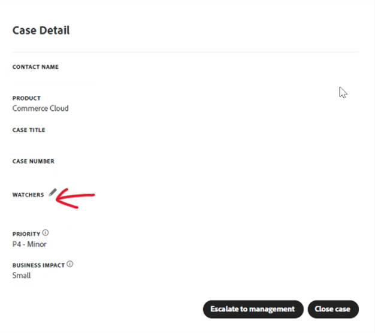

# Guia do usuário de suporte Experience League para Adobe Commerce

Neste guia, saiba como enviar um tíquete de suporte para o [Suporte para Experience League](https://experienceleague.adobe.com/home#support) e fornecer acesso compartilhado às contas do Adobe Commerce.

>[!NOTE]
>
>O suporte da Adobe Commerce migrou do Centro de ajuda da Adobe Commerce para o Experience League. Use o fluxo de formulário do caso Experience League descrito [aqui](#what-is-experience-support) para enviar casos de suporte.

>[!NOTE]
>
>A parte da Base de conhecimento do Adobe Commerce Help Center migrou para o portal da Adobe Experience League. Ao criar um tíquete de suporte, serão sugeridos artigos relacionados da Knowledge base, juntamente com outra documentação relevante do Adobe Commerce no Adobe Experience League.

**Atualização principal:** 29 de julho de 2024

**[O QUE É SUPORTE PARA EXPERIENCE LEAGUE?](#what-is-experience-support)**

**[CASOS DE SUPORTE](#support-cases)**

* [Entrar no suporte para Experience League](#sign-in-experience-support)
* [Enviar um caso de suporte](#submit-case)

   * [Página inicial do Adobe Experience League](#experience-league-start-page)
   * [Página da conta do Adobe Commerce](#submit-case-adobe-commerce-account-page)
   * [*Verifique seu endereço de email*](#verify-email-address-error)

* [Acompanhe seus casos de suporte](#track-support-cases)
* [Comentários no seu caso](#comments-in-your-case)
* [Feche seu caso](#close-case)
* [Reabra seu caso](#reopen-case)
* [Enviar tíquete usando o Cloud Console](#cloud-console)
* [Linha direta Adobe Commerce P1](#P1-hotline)
* [Modelo operacional de responsabilidade compartilhada da Adobe Commerce](#shared-responsibility-operational-model)

**[ACESSO COMPARTILHADO: CONCEDER PRIVILÉGIOS PARA QUE OUTROS USUÁRIOS ACESSEM SUA CONTA](#shared-access)**

* [Quem pode fornecer acesso compartilhado](#who-can-provide-shared-access)
* [Fornecer acesso compartilhado](#provide-shared-access)
* [Revogar (excluir) o acesso compartilhado](#revoke-shared-access)

   * [Como excluir usuários que receberam acesso compartilhado por meio de um projeto na nuvem?](#remove-cloud-shared-access-users)

* [Acessar conta compartilhada (alternar contas)](#switch-accounts)
* [Solução de problemas de acesso compartilhado](#troubleshooting-shared-access)

**[PERGUNTAS FREQUENTES SOBRE COBRANÇA DO ADOBE COMMERCE](#billing-faq)**

## O QUE É SUPORTE PARA EXPERIENCE LEAGUE? {#what-is-experience-support}

O Experience League Support é um portal de suporte para o Adobe, no qual os clientes qualificados da Adobe Commerce podem enviar e gerenciar tíquetes de suporte. Também é onde você pode consultar os artigos de solução de problemas.

## CASOS DE SUPORTE {#support-cases}

O Gerenciamento de casos de suporte da Adobe Experience League permite trabalhar com suporte através de casos para resolver problemas específicos encontrados durante o uso de produtos Adobe, incluindo o Adobe Commerce, para todos os produtos Adobe Commerce sob contrato.

## FAZER LOGON NO SUPORTE PARA EXPERIENCE LEAGUE {#sign-in-experience-support}

Ao fazer logon, você pode enviar, atualizar e responder a perguntas dos agentes sobre tíquetes de suporte.

Para fazer logon no Suporte da Adobe Experience League, siga estas etapas:

1. Navegue até [experienceleague.adobe.com](https://experienceleague.adobe.com/).
1. Faça logon usando suas credenciais de logon do Adobe.

### Enviar um caso de suporte {#support-case}

Depois de fazer logon, você pode enviar um caso de suporte usando a página inicial do Adobe Experience League, a página da conta do Adobe Commerce e a página da conta do Adobe Commerce Cloud.

* Se você for o proprietário da conta, siga as etapas abaixo.
* Se você for um usuário de Acesso Compartilhado, deverá primeiro trocar de conta. Consulte [Acessar conta compartilhada (alternar contas)](https://experienceleague.adobe.com/en/docs/commerce-knowledge-base/kb/help-center-guide/magento-help-center-user-guide#switch-accounts) e você poderá prosseguir para as etapas abaixo.

#### Página inicial do Adobe Experience League {#experience-league-start-page}

Para enviar um novo caso de suporte usando a página inicial do Adobe Experience League, siga estas etapas:

>[!INFO]
>
>1. Se você pertencer a várias organizações, precisará selecionar a organização apropriada na lista suspensa.
>1. Para enviar um caso, você deve ter direito a suporte. Caso não esteja, uma barra será exibida na parte superior da página informando que você não é um usuário com direito a suporte na organização.

1. Clique em **Suporte** no cabeçalho. Ele abrirá a página inicial do Suporte.

   

1. Para iniciar o processo de entrada de suporte, verifique se você selecionou a organização apropriada na lista suspensa (se disponível), pois pode haver várias organizações com nomes semelhantes, cada uma com seus próprios direitos.

   

1. Clique em **[!UICONTROL Open Ticket]** no menu à esquerda ou clique em **[!UICONTROL Get Started]** no cartão *[!UICONTROL Open a support ticket]*.

   

1. Selecione um produto no menu suspenso e forneça um título de caso e uma descrição.

   

1. O Adobe Experience League sugerirá artigos e práticas recomendadas que podem ajudar você a resolver seu caso. Se ainda precisar de suporte direto, forneça algumas informações adicionais antes de enviar seu caso.

   

1. Depois de preencher todas as informações necessárias, clique em **[!UICONTROL Submit case]**.

>[!IMPORTANT]
>
>Se você não conseguir ver sua organização no menu suspenso de organização ao fazer logon em experienceleague.adobe.com, talvez seja necessário sincronizar o perfil com accounts.magento.com antes de solicitar suporte ou gerenciar um caso de suporte existente.   
>
>1. Navegue até accounts.magento.com e faça logon com o mesmo perfil (corporativo, escolar ou pessoal) que você usará para gerenciar casos de suporte no Adobe Experience League. 
>1. Depois de fazer logon no perfil accounts.magento.com, navegue de volta para experienceleague.adobe.com e faça logon. 
>1. Selecione sua organização no menu suspenso de organização. 
>1. Se sua organização ainda não aparecer, entre em contato com o administrador do Commerce para obter os direitos de representante de suporte. Para obter informações adicionais, consulte o artigo de ajuda [Compartilhamento de conta da Commerce](https://experienceleague.adobe.com/en/docs/commerce-admin/start/commerce-account/commerce-account-share). 

Você deve ter uma conta em https://account.adobe.com e https://account.magento.com para fazer logon no Experience League para enviar um caso de suporte. Você não poderá enviar um caso de suporte até entrar.

>[!NOTE]
>
>Se você já tiver uma conta em https://account.magento.com, mas não puder fazer logon, talvez não tenha se registrado para uma conta em https://account.adobe.com, que é necessária a partir de agosto de 2022.
>
>Para resolver isso:
>1. Crie uma conta em https://account.adobe.com usando o mesmo endereço de email em sua ID MAG.
>1. Acesse https://account.magento.com para vincular seu Adobe ID com a ID MAG.

#### Página da conta do Adobe Commerce {#submit-case-adobe-commerce-account-page}

Para enviar um novo tíquete de suporte usando a página de conta da Adobe Commerce, siga estas etapas:

1. Faça logon em sua conta da Adobe Commerce. Consulte [instruções detalhadas](https://experienceleague.adobe.com/docs/commerce-admin/start/commerce-account/commerce-account-create.html?lang=en#create-a-commerce-account) em nosso guia do usuário.
1. Clique na guia **Suporte**.

   {width="800"}

1. A página de suporte do Adobe Experience League é carregada para você.
1. Selecione **[!UICONTROL Open Ticket]** no menu à esquerda.
1. Preencha os campos.
1. Clique em **Enviar**.

#### *Verifique o erro de seu endereço de email* na página da conta da Adobe Commerce {#verify-email-address-error}

Você não poderá enviar um tíquete de suporte se receber o erro Verifique seu endereço de email semelhante ao abaixo na página [conta da Adobe Commerce](https://account.magento.com/).

### Acompanhe seus casos de suporte {#track-support-case}

Os casos de suporte são aqueles que você:

* se submeteram pessoalmente.
* foram adicionados ao como observador por meio de uma CC (cópia carbono).

#### Veja seus casos

Você pode ver seus casos clicando em **[!UICONTROL My Cases]** no menu à esquerda.

#### Pesquisar casos

Para encontrar casos, digite a consulta de pesquisa no campo *[!UICONTROL Search]* e pressione *enter* no teclado.

#### Encaminhe seus casos

Se achar que um caso requer mais atenção e nosso tempo de resposta inicial já passou, você poderá encaminhar o caso. Para fazer isso,

1. Clique em **[!UICONTROL Escalate to management]** na parte inferior direita do painel *[!UICONTROL Case Detail]*, no lado direito da tela.

   

1. Depois de clicar em, um formulário pop-up será exibido. Preencha o formulário e clique em **[!UICONTROL Escalate]**.

   

   *Os motivos para escalonamento podem incluir*: Habilidades de Comunicação do Agente, Conhecimento Técnico do Agente, Aguardando Retorno/Atualização de Chamada, Alteração na Urgência do Problema, Resolução não atendeu às expectativas ou Tempo para Resolução.

#### Adicionar um inspetor aos casos de suporte

Você pode adicionar observadores para dar suporte a casos enviados por membros de sua organização. Os observadores receberão notificações por email quando novos casos forem enviados ou quando os casos existentes forem atualizados.

1. Para adicionar um inspetor a um caso existente, abra o caso e clique no ícone de lápis ao lado de &quot;inspetores&quot; no painel Detalhes do caso no lado direito da tela.

   

1. Depois de clicar no lápis, você pode adicionar ou remover inspetores da lista.

   

### Comentários no seu caso {#comments-in-your-case}

Os comentários no seu caso contêm todos os comentários escritos por você ou pela equipe de suporte da Adobe Commerce. Os comentários são exibidos da mais recente (na parte superior) para a mais recente (na parte inferior).
Para adicionar um comentário, siga estas etapas:

1. Role até a parte inferior do seu tíquete.
1. Escreva seu comentário no campo **[!UICONTROL Comments]** e clique em **[!UICONTROL Add comments]**.

### Feche seu caso {#close-case}

Para fechar o caso, clique em **[!UICONTROL Close case]** na parte inferior direita do painel *[!UICONTROL Case Detail]*.

### Reabra seu caso {#reopen-case}

Para reabrir seu caso, responda ao e-mail do nosso Sistema de Suporte relacionado a esse caso e solicite ao agente que o reabra. Se você fizer isso dentro de 14 dias do fechamento do caso, o agente poderá reabrir o caso para você. No entanto, se for após 14 dias, o agente terá que criar um novo caso.

### Enviar tíquete usando o Cloud Console {#cloud-console}

Para enviar um novo tíquete de suporte usando o Cloud Console, siga estas etapas:

1. Faça logon no [Cloud Console](https://console.adobecommerce.com).
1. Selecione **[!UICONTROL Support]** no menu do usuário.
1. A página **[!UICONTROL My Tickets]** é carregada.
1. Clique em **[!UICONTROL Submit a ticket]** no canto superior direito.
1. Preencha os campos.
1. Clique em **Enviar**.
1. Clique em **[!UICONTROL Submit]**.

### Linha direta Adobe Commerce P1 {#P1-hotline}

O artigo [Linha direta P1 da Adobe Commerce](https://experienceleague.adobe.com/docs/commerce-knowledge-base/kb/how-to/adobe-commerce-p1-notification-hotline.html) fornece os números de linha direta P1 para a Adobe Commerce quando buscar ajuda durante um incidente P1 e explica quais informações fornecer.

### Modelo operacional de responsabilidade compartilhada da Adobe Commerce {#shared-responsibility-operational-model}

Consulte o artigo sobre [Modelo operacional de responsabilidade compartilhada da Adobe Commerce](https://experienceleague.adobe.com/en/docs/commerce-operations/security-and-compliance/shared-responsibility#operational-responsibilities-summary),
que visa esclarecer as responsabilidades operacionais somente para nossa oferta de infraestrutura Pro.

### Abrir um tíquete de acompanhamento {#follow-up}

A abertura de um tíquete de acompanhamento garantirá que o problema original esteja vinculado ao tíquete de acompanhamento para continuidade.

Para abrir um tíquete de acompanhamento, clique no link &quot;*criar um acompanhamento*&quot; na parte inferior do tíquete para o qual deseja criar um acompanhamento.

## ACESSO COMPARTILHADO: CONCEDER PRIVILÉGIOS PARA QUE OUTROS USUÁRIOS ACESSEM SUA CONTA {#shared-access}

Você pode conceder acesso limitado à sua conta para outros titulares de conta da Adobe Commerce. Especificamente, usando a funcionalidade **acesso compartilhado**, você pode fornecer privilégios para que funcionários e provedores de serviços confiáveis usem sua conta da Central de Ajuda para que eles possam trabalhar com seus tíquetes de suporte.

Você pode fornecer e gerenciar o acesso compartilhado usando sua página da conta do Adobe Commerce em [https://account.magento.com](https://account.magento.com/).

### Quem pode fornecer acesso compartilhado {#who-can-provide-shared-access}

Somente o proprietário da conta (titular primário da conta) com os privilégios descritos pode fornecer acesso compartilhado para outros usuários.

Gerenciar usuários e seu acesso é responsabilidade do cliente, especialmente na perspectiva de acesso compartilhado. Assim, a equipe de suporte da Adobe Commerce não pode fornecer acesso compartilhado a uma conta da Adobe Commerce em nome de um Cliente. Os clientes são incentivados a adicionar usuários com acesso compartilhado, usando a [página da conta do Adobe Commerce](https://account.magento.com/).

Os usuários que receberam acesso compartilhado não podem transferir ou conceder esse acesso a outros usuários.

### Fornecer acesso compartilhado {#provide-shared-access}

Consulte a seção [Compartilhar uma conta do Commerce](https://experienceleague.adobe.com/en/docs/commerce-admin/start/commerce-account/commerce-account-share) do Guia de Introdução do Adobe Commerce para obter as etapas detalhadas sobre como configurar uma conta compartilhada.

Depois de fornecer acesso compartilhado a um novo usuário, as informações relacionadas ficam disponíveis em **Acesso Compartilhado** > **Gerenciar Permissões** da página da sua conta do Adobe Commerce.

### Revogar (excluir) o acesso compartilhado {#revoke-shared-access}

1. Faça logon em sua conta da Adobe Commerce em [https://account.magento.com](https://account.magento.com/).
1. No painel à esquerda, em Acesso Compartilhado, escolha **Gerenciar Permissões.**
1. Localize o usuário do qual revogar o acesso compartilhado e clique em {width="25"} na linha do usuário (**coluna Ações**).
1. Clique em **Excluir usuário** para revogar o acesso ou X no canto superior para cancelar a revogação.

   {width="800"}

   Você também pode revogar o acesso compartilhado usando o menu **Editar**:

1. Faça logon em sua conta da Adobe Commerce em [https://account.magento.com](https://account.magento.com/).
1. No painel à esquerda, em Acesso Compartilhado, escolha **Gerenciar Permissões.**
1. Localize o usuário do qual revogar o acesso compartilhado e clique em **Editar** na linha do usuário (coluna **Ações**).
1. Clique em **Excluir este usuário** na parte inferior da página.
1. No pop-up de confirmação, clique em **Excluir usuário** para revogar o acesso ou em X no canto superior para cancelar a revogação.

### Como excluir usuários que receberam acesso compartilhado por meio de um projeto na nuvem? {#remove-cloud-shared-access-users}

<u>Produtos e versões afetados</u>

* Adobe Commerce Cloud (todas as versões)

<u>Causa</u>

Se você tiver/tiver tido um projeto do Adobe Commerce Cloud e tiver adicionado um usuário ao projeto, ele receberá automaticamente o Acesso compartilhado na ID de MAGE do proprietário do projeto. Isso normalmente seria indicado na coluna **[!UICONTROL Share Name]**, mostrando o *Acesso Compartilhado na Nuvem de MAG[XYZ]*.

Se o link DELETE estiver ausente, significa que o Acesso Compartilhado foi concedido automaticamente por meio do Commerce Cloud.

<u>Solução</u>

Não é possível excluir a lista de usuários de Acesso Compartilhado com o Nome de Compartilhamento do *Acesso Compartilhado na Nuvem da MAG[XYZ]* se o Acesso Compartilhado não tiver sido adicionado/fornecido nesta página. Elas são mantidas para fins informativos/de auditoria.

No entanto, após revogar as permissões desses usuários do Acesso compartilhado, eles não terão mais esse acesso.

1. Faça logon em sua conta da Adobe Commerce em [https://account.magento.com](https://account.magento.com/).
1. No painel à esquerda, em *[!UICONTROL Shared Access]*, escolha **[!UICONTROL Manage Permissions]**.
1. Localize o usuário do qual revogar o acesso compartilhado e clique em **[!UICONTROL Edit]** na linha do usuário (coluna *[!UICONTROL Actions]*).
1. Desmarcar todos os recursos em *[!UICONTROL Grant Account Permissions]*.

{width="800"}

Para obter mais informações, consulte a documentação [Gerenciar acesso do usuário](https://experienceleague.adobe.com/docs/commerce-cloud-service/user-guide/project/user-access.html#manage-users-from-the-project-web-interface) em nosso Guia de Infraestrutura do Commerce na Nuvem.

### Acessar conta compartilhada (alternar contas) {#switch-accounts}

Para usar o acesso compartilhado fornecido para você, siga estas etapas:

1. Faça logon em sua conta da Adobe Commerce em [https://account.magento.com](https://account.magento.com/).
1. Clique no menu **Alternar contas** e selecione uma conta.

   {width="800"}

Para saber qual conta você está usando atualmente (sua própria conta nativa ou acesso compartilhado), consulte o menu **Alternar contas**: ele exibe a conta ativa.

### Solução de problemas de acesso compartilhado {#troubleshooting-shared-access}

Consulte o [Artigo sobre solução de problemas de acesso compartilhado](/help/troubleshooting/miscellaneous/shared-access-troubleshooting.md) em nossa knowledge base de suporte.

## PERGUNTAS FREQUENTES SOBRE FATURAMENTO DO ADOBE COMMERCE {#billing-faq}

Normalmente, os comerciantes pagam pelos nossos serviços por meio de uma transação com cartão de crédito (CC). Estas [Perguntas frequentes sobre cobrança do Adobe Commerce](/help/faq/general/billing-faq-for-adobe-commerce.md) são um recurso que ajuda você a pagar sua conta.

