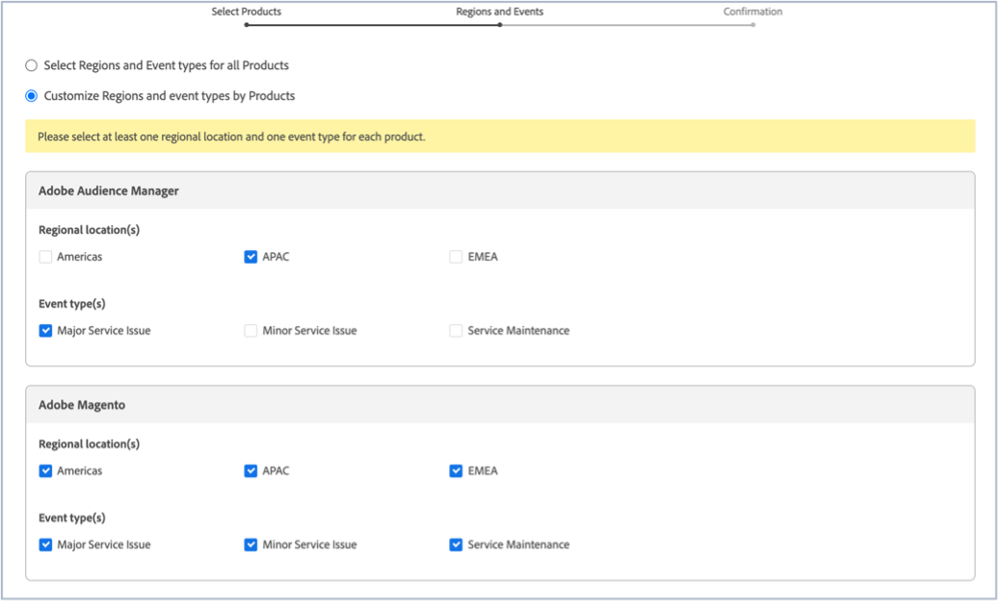

# Como se inscrever para obter atualizações de status do Adobe Commerce

## Como se inscrever para obter atualizações de status do Adobe Magento

1. Ir para [status do Adobe](https://status.adobe.com).
1. Clique em **Entrar**.
1. Faça logon com as credenciais de Adobe.
1. Selecione **Conta da Empresa ou da Escola** se a opção for apresentada.
1. Clique em **Gerenciar assinaturas** no canto superior direito, acima das Nuvens listadas.

   
1. Clique em **Criar assinaturas**.

   
1. Você verá uma janela onde é possível selecionar notificações para produtos. Ela pode ser diferente da captura de tela a seguir, pois algumas assinaturas podem ser pré-selecionadas com base no seu perfil ou porque você já configurou algumas assinaturas. Clique em **Adobe Magento** em Experience Cloud. Se você quiser receber notificações para todos os serviços de Magento Adobe, marque a caixa de seleção Magento Adobe. Isso selecionará automaticamente todos os serviços de Magento Adobe que você pode ver quando a seção Magento Adobe se expande (veja a captura de tela).

   

   Como alternativa, para selecionar um serviço de Magento de Adobe, desmarque as caixas de seleção dos outros serviços de Magento de Adobe. Portanto, por exemplo, se você quiser receber apenas notificações para Order Management (MOM), desmarque os outros serviços, para que somente a caixa de seleção Adobe Magento e a caixa de seleção Order Management (MOM) sejam marcadas (consulte a captura de tela).

   
1. Você verá uma janela onde é possível selecionar notificações para produtos para determinadas regiões e eventos. Se você quiser receber notificações para as mesmas regiões e tipos de evento para todos os produtos, marque a caixa de seleção **Selecionar regiões e tipos de evento para todos os produtos** (veja a captura de tela).

   

   Como alternativa, se você tiver assinado vários produtos (não apenas o Adobe Magento) e quiser que cada produto tenha notificações para diferentes regiões e tipos de evento, marque a caixa de seleção **Personalizar regiões e tipos de evento por produtos** (veja a captura de tela).

   
1. Clique em **Continuar**.
1. A janela **Confirmar suas preferências de assinatura** é exibida. Verifique se as notificações refletem o que você deseja. Clique em **Concluído**.

Depois de clicar em **Concluído**, você verá um resumo das suas assinaturas de produtos e eventos e receberá um email intitulado &quot;Assinatura para notificações por email de status&quot; do Adobe. Se quiser cancelar a assinatura e/ou alterar as configurações de notificação, repita as etapas de um a nove.
