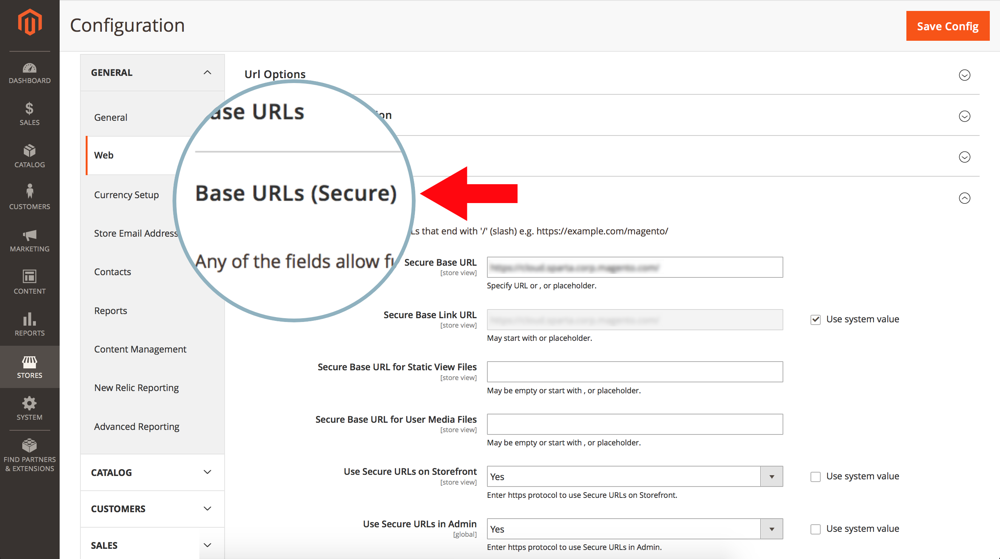
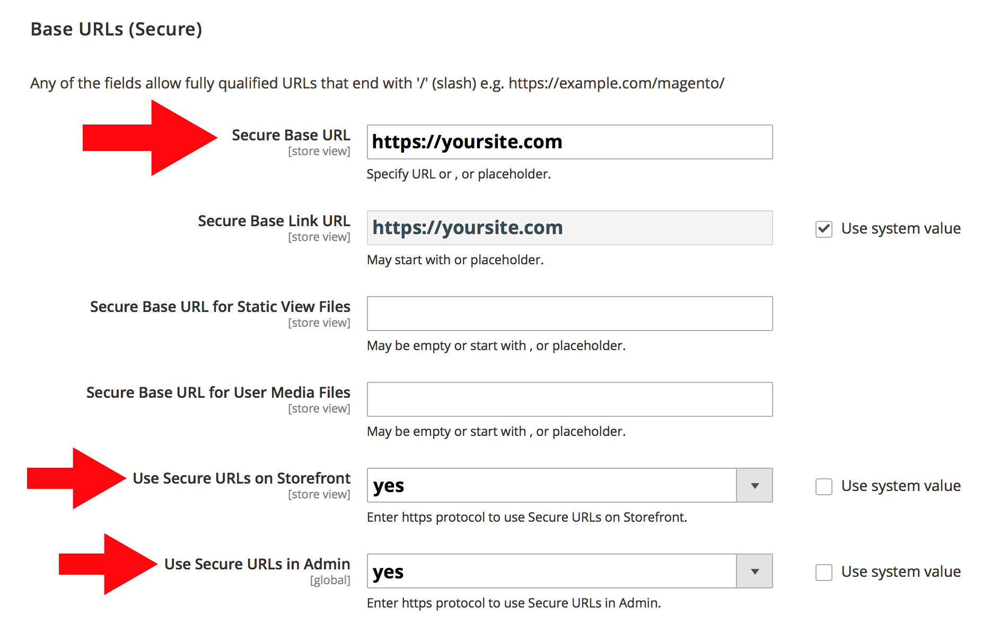
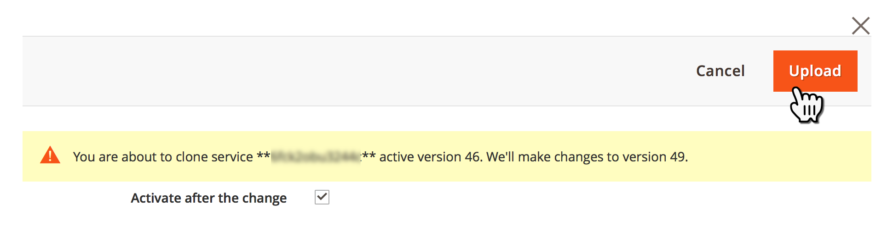

# Redirecionar HTTP para HTTPS para todas as páginas no Adobe Commerce na infraestrutura em nuvem (Forçar TLS)

Ative a funcionalidade **Forçar TLS** do Fastly no Administrador do Commerce para habilitar o redirecionamento global HTTP para HTTPS para todas as páginas do Adobe Commerce no repositório de infraestrutura na nuvem.

Este artigo fornece [etapas](#steps) detalhadas, uma visão geral rápida do recurso Forçar TLS, versões afetadas e links para a documentação relacionada.

## Etapas {#steps}

### Etapa 1: configurar URLs seguros {#step-1-configure-secure-urls}

Nesta etapa, definimos os URLs seguros do armazenamento. Se isso já tiver sido feito, vá para [Etapa 2: Habilitar Forçar TLS](#step-2-enable-force-tls).

1. Faça logon no Administrador do Commerce.
1. Navegue até **Lojas** > **Configuração** > **Geral** > **Web**.
1. Expanda a seção **URLs de Base (Seguros)**.    
1. No campo **URL de Base Segura**, especifique a URL HTTPS do seu armazenamento.
1. Defina as configurações **Usar URLs Seguras na Loja** e **Usar URLs Seguras na Administração** para **Sim**.    
1. Clique em **Salvar configuração** no canto superior direito para aplicar as alterações.

**Documentação relacionada em nosso guia do usuário:**   [Armazenar URLs](https://experienceleague.adobe.com/en/docs/commerce-admin/stores-sales/site-store/store-urls).

### Etapa 2: Ativar Forçar TLS {#step-2-enable-force-tls}

1. No Administrador do Commerce, navegue até **Lojas** > **Configuração** > **Avançado** > **Sistema**.
1. Expanda a seção **Cache de Página Inteira** e depois a **Configuração Rápida** e, em seguida, a **Configuração Avançada**.
1. Clique no botão **Forçar TLS**.    
1. Na caixa de diálogo exibida, clique em **Carregar**.    
1. Depois que a caixa de diálogo for fechada, verifique se o estado atual de Forçar TLS é exibido como **habilitado**.    

**Documentação do Fastly relacionada:**   [Guia Forçar TLS](https://github.com/fastly/fastly-magento2/blob/master/Documentation/Guides/FORCE-TLS.md) para o Adobe Commerce 2.

## Sobre o Force TLS

TLS (Transport Layer Security) é um protocolo para conexões HTTP seguras que substitui seu antecessor menos seguro — o protocolo SSL (Secure Socket Layer).

A funcionalidade Forçar TLS do Fastly permite forçar todas as solicitações não criptografadas recebidas para as páginas do site para o TLS.

>>
Funciona retornando uma resposta *301 Movido Permanentemente* para qualquer solicitação não criptografada, que redireciona para o equivalente TLS. Por exemplo, fazer uma solicitação para *http://www.example.com/foo.jpeg* redirecionaria para *https://www.example.com/foo.jpeg*.

[Protegendo comunicações](https://docs.fastly.com/guides/securing-communications/) (documentação do Fastly)

## Versões afetadas

* **Adobe Commerce na infraestrutura em nuvem:**
   * versão: 2.1.4 e posterior
   * planos: Adobe Commerce na infraestrutura em nuvem Arquitetura do plano inicial e Adobe Commerce na infraestrutura em nuvem Arquitetura do plano Pro (incluindo Pro Legacy)
* **Fastly:** 1.2.4

## Nenhuma alteração necessária em route.yaml

Para habilitar o redirecionamento de HTTP para HTTPS em **todas** as páginas do armazenamento, não é necessário adicionar as páginas ao arquivo de configuração `routes.yaml`. Habilitar Forçar TLS globalmente para todo o armazenamento (usando o Administrador do Commerce) é suficiente.

## Documentação relacionada do Fastly

* [Guia Forçar TLS para o Adobe Commerce 2](https://github.com/fastly/fastly-magento2/blob/master/Documentation/Guides/FORCE-TLS.md)
* [Forçando um redirecionamento TLS](https://docs.fastly.com/guides/securing-communications/forcing-a-tls-redirect)
* [Protegendo comunicações](https://docs.fastly.com/guides/securing-communications/)
