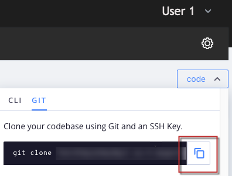

# Redefinir o ambiente no Adobe Commerce na infraestrutura em nuvem

Este artigo mostra diferentes cenários de reversão de um ambiente no Adobe Commerce na infraestrutura em nuvem.

Escolha o mais apropriado para seu caso:

* Se você tiver uma atividade planejada (implantação ou atualização planejada) - [Cenário 1: atividade planejada)](#scen1).
* Se você tiver um instantâneo válido - [Cenário 2: restaurar um instantâneo](#scen2).
* Se você tiver uma build estável, mas nenhum instantâneo válido - [Cenário 3: nenhum instantâneo, build estável (conexão SSH disponível)](#scen3).
* Se a build estiver corrompida e você não tiver um instantâneo válido - [Cenário 4: nenhum instantâneo; build interrompida (sem conexão SSH)](#scen4).

## Cenário 1: atividade planejada

Com uma implantação ou atualização planejada, o mais fácil e recomendado [!UICONTROL Rollback] seria para o comerciante, como parte de suas preparações, fazer o seguinte:

>[!NOTE]
>
>Sempre teste essas etapas no **[!UICONTROL Staging Environment]** primeiro!

<u>Cinco dias antes das atividades de atualização/implantação</u>:

1. Verifique o tamanho do Banco de Dados atual.
1. Verifique se há espaço em disco suficiente no `/data/exports` para manter um [!UICONTROL Database Dump]. Se não houver espaço em disco suficiente, remova os dados indesejados ou crie um caso de suporte e solicite a expansão do disco.

<u>No dia das alterações</u>:

1. Colocar o site em [!UICONTROL Maintenance Mode].<br>
Leia mais sobre [Ativar ou desativar [!UICONTROL Maintenance Mode]](https://experienceleague.adobe.com/docs/commerce-operations/installation-guide/tutorials/maintenance-mode.html) em nosso guia do usuário e [[!UICONTROL Maintenance Mode] opções de atualização](https://experienceleague.adobe.com/docs/commerce-operations/upgrade-guide/troubleshooting/maintenance-mode-options.html) em nosso guia de atualização.
1. Pegar um local [[!UICONTROL Database Dump]](https://experienceleague.adobe.com/docs/commerce-knowledge-base/kb/how-to/create-database-dump-on-cloud.html).

<u>Se um [!UICONTROL Rollback] é obrigatório</u>:

1. Se aplicativos como o [!DNL MariaDB] foi atualizado como parte dessa atividade planejada, primeiro instale esse aplicativo em uma versão anterior.
1. [!UICONTROL Rollback] o Banco de Dados usando o local [!UICONTROL Database Dump]e importe-o de volta para o [!DNL MariaDB].
1. [!UICONTROL Rollback] o código via [!DNL Git] para uma versão anterior em funcionamento.

Usar [!UICONTROL Snapshots] não é a maneira recomendada de atualizar/planejar a atividade [!UICONTROL rollbacks/restores], pois demora muito mais para recuperar os dados em comparação a um local [!UICONTROL Database Dump], conforme descrito na Etapa 2 do **Se um [!UICONTROL Rollback] é obrigatório** seção.

[!UICONTROL Snapshots] não são mantidos no nó/servidor, são mantidos em um bloco de armazenamento separado e, como esses dados precisam ser transmitidos do armazenamento em bloco pela rede para um novo disco, leva tempo no processo. Esse novo disco é então montado no nó pronto para recuperação/importação no disco original conectado ao nó/servidor.

Quando você compara isso com a importação de um local [!UICONTROL Database Dump], os dados já podem ser recuperados no nó/servidor, portanto, economizamos muito tempo, pois somente um [!UICONTROL Database Import] é obrigatório.

## Cenário 2: restaurar um instantâneo

Lido: [Restaurar um instantâneo no Adobe Commerce na infraestrutura em nuvem](https://devdocs.magento.com/cloud/project/project-webint-snap.html#restore-snapshot) na documentação do desenvolvedor.

>[!NOTE]
>
>Criar um instantâneo deve ser o primeiro passo após acessar a conta do Adobe Commerce na infraestrutura em nuvem e antes de aplicar grandes alterações. É uma prática recomendada e altamente recomendada.

Lido: [Criar um instantâneo](https://devdocs.magento.com/cloud/project/project-webint-snap.html#create-snapshot) na documentação do desenvolvedor.

## Cenário 3: nenhum instantâneo, build estável (conexão SSH disponível)

Esta seção mostra como redefinir um ambiente quando você não tiver criado um instantâneo, mas puder acessar o ambiente via SSH.

As etapas são:

1. Desative o gerenciamento de configurações.
1. Desinstale o software Adobe Commerce.
1. Redefina o [!DNL git] filial.

Depois de executar essas etapas:

* Sua instalação do Adobe Commerce retorna ao estado Vanilla (banco de dados restaurado; configuração de implantação removida; diretórios em `var` desmarcado).
* Seu [!DNL git] A ramificação é redefinida para o estado desejado no passado.

Leia as etapas detalhadas abaixo.

### Etapa 0 (Pré-requisito): Remova o config.php para desativar o Gerenciamento de Configuração

Precisamos desabilitar o Gerenciamento de Configurações para que ele não aplique automaticamente as definições de configuração anteriores durante a implantação.

Para desativar o Gerenciamento de configurações, verifique se `/app/etc/` o diretório não contém o `config.php` arquivo.

Para remover o arquivo de configuração, siga estas etapas:

1. [SSH para o seu ambiente](https://experienceleague.adobe.com/docs/commerce-cloud-service/user-guide/develop/secure-connections.html).
1. Remova o arquivo de configuração: `rm app/etc/config.php`

Leia mais sobre o Gerenciamento de configuração:

* [Reduza o tempo de inatividade da implantação no Adobe Commerce na infraestrutura em nuvem](/help/how-to/general/magento-cloud-reduce-deployment-downtime-with-configuration-management.md) em nossa base de conhecimento de suporte.
* [Gerenciamento de configurações para configurações de armazenamento](https://experienceleague.adobe.com/docs/commerce-cloud-service/user-guide/configure-store/store-settings.html) na documentação do desenvolvedor.

### Etapa 1: Desinstale o software Adobe Commerce com o comando setup:uninstall


A desinstalação do software Adobe Commerce remove e restaura o banco de dados, remove a configuração de implantação e limpa diretórios em `var`.

Lido: [Desinstale o software Adobe Commerce](https://experienceleague.adobe.com/docs/commerce-operations/installation-guide/tutorials/uninstall.html) na documentação do desenvolvedor.

Para desinstalar o software Adobe Commerce, siga estas etapas:

1. [SSH para o seu ambiente](https://experienceleague.adobe.com/docs/commerce-cloud-service/user-guide/develop/secure-connections.html).
1. Executar `setup:uninstall` : `bin/magento setup:uninstall`
1. Confirme a desinstalação.

A seguinte mensagem é exibida para confirmar uma desinstalação bem-sucedida:

```php
[SUCCESS]: Magento uninstallation complete.
```

Isso significa que revertemos nossa instalação do Adobe Commerce (incluindo o DB) para seu estado autêntico (Vanilla).

### Etapa 2: redefinir o [!DNL git] ramificação

Com [!DNL git] redefinir, revertemos o código para o estado desejado no passado.

1. Clonar o ambiente no ambiente de desenvolvimento local. Você pode copiar o comando no Cloud Console:    
1. Acesse o histórico de confirmações. Uso `--reverse` para exibir o histórico em ordem inversa para maior comodidade: `git log --reverse`
1. Selecione o hash de confirmação no qual você esteve em boas condições. Para redefinir o código para seu estado autêntico (Vanilla), localize a primeira confirmação que criou sua ramificação (ambiente).
   
1. Aplicar disco rígido [!DNL git] redefinir: `git reset --h <commit_hash>`
1. Enviar alterações para o servidor: `git push --force <origin> <branch>`

Após executar essas etapas, nossa [!DNL git] a ramificação é redefinida e o [!DNL git] changelog está limpo. O último [!DNL git] o push aciona a reimplantação para aplicar todas as alterações e reinstalar o Adobe Commerce.

## Cenário 4: nenhum instantâneo; build corrompida (não [!DNL SSH] conexão)

Esta seção mostra como redefinir um ambiente quando ele está em um estado crítico: o procedimento de implantação não pode ser bem-sucedido na criação de um aplicativo em funcionamento, tornando o [!DNL SSH] conexão indisponível.

Nesse cenário, primeiro restaure o estado de funcionamento do aplicativo do Adobe Commerce usando [!DNL git] redefina e desinstale o software Adobe Commerce (para descartar e restaurar o banco de dados, remover a configuração de implantação etc.). O cenário envolve as mesmas etapas do Cenário 3, mas a ordem das etapas é diferente e há uma etapa adicional - forçar reimplantação. As etapas são:

1. [Redefina o [!DNL git] filial.](/help/how-to/general/reset-environment-on-cloud.md#reset-git-branch)
1. [Desative o gerenciamento de configurações.](/help/how-to/general/reset-environment-on-cloud.md#disable_config_management)
1. [Desinstale o software Adobe Commerce.](/help/how-to/general/reset-environment-on-cloud.md#setup-uninstall)
1. Forçar reimplantação.

Depois de executar essas etapas, você terá os mesmos resultados do Cenário 3.

### Etapa 4: Forçar reimplantação

Faça uma confirmação (pode ser uma confirmação vazia, embora não recomendemos) e envie-a para o servidor para acionar a reimplantação:

```git
git commit --allow-empty -m "<message>" && git push <origin> <branch>
```

## Se a configuração:desinstalação falhar, redefina o banco de dados manualmente

Se estiver executando o `setup:uninstall` falha com um erro e não pode ser concluído, podemos limpar o DB manualmente com estas etapas:

1. [SSH para o seu ambiente](https://experienceleague.adobe.com/docs/commerce-cloud-service/user-guide/develop/secure-connections.html).
1. Conectar ao BD MySQL: `mysql -h database.internal` (Para ambientes Pro, consulte: [Configurar o serviço MySQL](https://experienceleague.adobe.com/docs/commerce-cloud-service/user-guide/configure/service/mysql.html)).
1. Solte o `main` BD: `drop database main;`
1. Criar um vazio `main` BD: `create database main;`
1. Exclua os seguintes arquivos de configuração: `config.php` , `config.php` , `.bak,` , `env.php`, `env.php.bak`

Depois de redefinir o BD, [criar um [!DNL git] enviar para o ambiente para acionar a reimplantação](https://experienceleague.adobe.com/docs/commerce-operations/configuration-guide/deployment/examples/example-using-cli.html) e instale o Adobe Commerce em um banco de dados recém-criado. Ou [executar o comando redeploy](https://experienceleague.adobe.com/docs/commerce-cloud-service/user-guide/dev-tools/cloud-cli.html#environment-commands).
