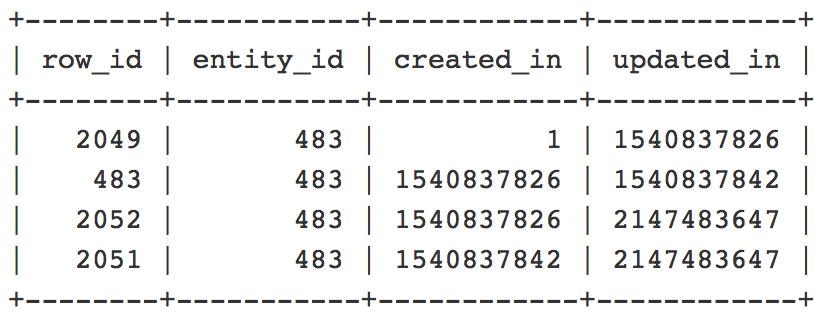

# Entradas duplicadas na tabela de catálogo após a edição da data final de uma atualização de agendamento

Este artigo fornece um patch para o problema conhecido do Adobe Commerce 2.2.3 em que editar a data ou hora de término de uma atualização de agendamento de regra de preço de catálogo resulta na adição de entradas duplicadas à tabela `catalogrule` e erros na reindexação do indexador `catalogrule_rule` (Produto de regra de catálogo).

## Problema

Quando você altera a data ou hora final de uma atualização de agendamento de regra de preço de catálogo existente, entradas duplicadas são criadas na tabela de banco de dados `catalogrule`. Como resultado, a reindexação `catalogrule_rule` falha com o seguinte erro no log de exceções: *Já existe um item com a mesma ID*.

<u>Etapas a serem reproduzidas</u>:

Pré-requisitos: O indexador `catalogrule_rule` está definido para o modo *[Atualizar na Agenda](https://experienceleague.adobe.com/docs/commerce-operations/implementation-playbook/best-practices/maintenance/indexer-configuration.html)*.

1. No Administrador do Commerce, crie uma nova Regra de preço de catálogo em **Marketing** > **Promoções** > **Regra de preço de catálogo**.
1. Na grade **Regra de Preço do Catálogo**, clique em **Editar**, agende uma nova Atualização e defina o **Status** como *Ativo.*
1. Clique em **Exibir/Editar** ao lado da Atualização recém-criada e altere a data de término para uma data anterior.
1. Salve a atualização.
1. Execute o comando reindex para o indexador `catalogrule_rule`.

<u>Resultado esperado</u>:

O indexador `catalogrule_rule` foi reindexado com êxito. Nenhuma entrada duplicada na tabela `catalogrule`.

<u>Resultado real</u>:

A reindexação falha com o seguinte erro: *Já existe um item com a mesma identificação*, pois há entradas duplicadas na tabela `catalogrule`.

## Solução

Para resolver o problema, você precisa aplicar o patch anexado e remover as entradas duplicadas existentes. Consulte a seção [Remover entradas duplicadas](#remove) para obter detalhes sobre como verificar se as duplicatas existem e como removê-las.

## Correção

O patch está anexado a este artigo. Para baixá-lo, role para baixo até o final do artigo e clique no nome do arquivo ou clique no link a seguir:

[Baixar MDVA-10974\_EE\_2.2.3\_COMPOSER\_v2.patch](assets/MDVA-10974_EE_2.2.3_COMPOSER_v2.patch.zip)

### Versões compatíveis do Adobe Commerce:

A correção foi criada para:

* Adobe Commerce 2.2.3

O patch também é compatível (mas pode não resolver o problema) com as seguintes versões e edições do Adobe Commerce:

* Adobe Commerce na infraestrutura em nuvem 2.2.1 - 2.2.5
* Adobe Commerce no local 2.2.1 - 2.2.2 e 2.2.4 - 2.2.5

## Como aplicar o patch

Consulte [Como aplicar um patch de compositor fornecido pelo Adobe](/help/how-to/general/how-to-apply-a-composer-patch-provided-by-magento.md) para obter instruções em nossa base de dados de conhecimento de suporte.

## Remover entradas duplicadas {#remove}

>[!NOTE]
>
>Certifique-se de ter um backup recente antes de qualquer manipulação.

Siga estas etapas para localizar as entradas duplicadas e excluí-las:

1. Execute a seguinte consulta para verificar se as entradas duplicadas existem no banco de dados:

   ```SQL
   SELECT entity_id, "catalog_product_entity" AS entity_table FROM catalog_product_entity GROUP BY entity_id, created_in HAVING COUNT(*) > 1    UNION    SELECT entity_id, "catalog_product_entity" AS entity_table FROM catalog_product_entity group by entity_id, updated_in having count(*) > 1    UNION    SELECT rule_id as entity_id, "catalogrule" AS entity_table FROM catalogrule GROUP BY entity_id, created_in HAVING COUNT(*) > 1    UNION    SELECT rule_id as entity_id, "catalogrule" AS entity_table FROM catalogrule GROUP BY entity_id, updated_in HAVING COUNT(*) > 1    UNION    SELECT rule_id as entity_id, "salesrule" AS entity_table FROM salesrule GROUP BY entity_id, created_in HAVING COUNT(*) > 1    UNION    SELECT rule_id as entity_id, "salesrule" AS entity_table FROM salesrule GROUP BY entity_id, updated_in HAVING COUNT(*) > 1    UNION    SELECT page_id as entity_id, "cms_page" AS entity_table FROM cms_page GROUP BY entity_id, created_in HAVING COUNT(*) > 1    UNION    SELECT page_id as entity_id, "cms_page" AS entity_table FROM cms_page GROUP BY entity_id, updated_in HAVING COUNT(*) > 1    UNION    SELECT block_id as entity_id, "cms_block" AS entity_table FROM cms_block GROUP BY entity_id, created_in HAVING COUNT(*) > 1    UNION    SELECT block_id as entity_id, "cms_block" AS entity_table FROM cms_block GROUP BY entity_id, updated_in HAVING COUNT(*) > 1;
   ```

   Se não houver entradas duplicadas, a resposta estará vazia e você não precisará fazer mais nada. Se houver entradas duplicadas, você obterá o nome da tabela e `entity_id` da entidade duplicada, como no exemplo a seguir:

   

   Considere que em determinadas tabelas o nome do campo com id de entidade será diferente de `entity_id`. Por exemplo, na tabela `cms_page`, seria `page_id` em vez de `entity_id`.

1. Em seguida, você precisa examinar as duplicatas mais detalhadamente e entender quais devem ser removidas. Use uma query semelhante à seguinte para ver as duplicatas. Substitua o nome da tabela, o nome da ID da entidade e o valor de acordo com os resultados recebidos na etapa anterior.

   ```sql
   SELECT row_id, entity_id, created_in, updated_in FROM catalog_product_entity WHERE entity_id = 483 ORDER BY created_in;
   ```

   Você receberá uma lista de registros com várias colunas. Exemplo:

   

   Os valores `created_in` e `updated_in` devem seguir este padrão: o valor `created_in` da linha atual é igual ao valor `updated_in` na linha anterior. Além disso, a **primeira linha** deve conter created\_in = 1 e a **última linha** deve conter updated\_in = 2147483647. (Se houver apenas uma linha, você deverá ver created\_in=1 **and** updated\_in=2147483647). A(s) linha(s) para a(s) qual(is) este padrão foi quebrado devem ser excluídas. Em nosso exemplo, seria a linha com `row_id` =2052, pois a segunda e a terceira linhas compartilham o mesmo valor para created_in: 1540837826, o que não deveria ocorrer.

1. Exclua a duplicata usando uma consulta semelhante à seguinte. Substitua o nome da tabela, o nome da ID da entidade e o valor de acordo com os resultados recebidos nas etapas anteriores:

   ```sql
   DELETE FROM catalog_product_entity WHERE entity_id = 483 AND row_id = 2052;
   ```

1. Limpar cache executando:

   ```bash
   bin/magento cache:clean
   ```

   ou no Administrador do Commerce em **Sistema** > **Ferramentas** > **Gerenciamento de Cache**.

## Links úteis em nossa documentação do desenvolvedor

* [Aplicar patches personalizados ao Adobe Commerce na infraestrutura em nuvem](https://experienceleague.adobe.com/docs/commerce-cloud-service/user-guide/develop/upgrade/apply-patches.html)
* [Exibir e gerenciar logs do Adobe Commerce na infraestrutura em nuvem](https://experienceleague.adobe.com/docs/commerce-cloud-service/user-guide/develop/test/log-locations.html))

## Arquivos Anexados
