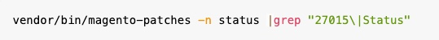

# Atualização de segurança disponível para o Adobe Commerce - [!DNL APSB24-40] Revisado para incluir correção isolada para [!DNL CVE-2024-34102]

Em 11 de junho de 2024, o Adobe lançou uma atualização de segurança para o Adobe Commerce, o Magento Open Source e o plug-in Webhooks do Adobe Commerce. Essa atualização soluciona vulnerabilidades críticas e importantes.  A exploração bem-sucedida pode levar à execução arbitrária de código, ao desvio de recursos de segurança e ao escalonamento de privilégios.

**Em 27 de junho de 2024, o Adobe lançou um patch isolado para [!DNL CVE-2024-34102].**

**Informações adicionais sobre [!DNL CVE-2024-34102] pode ser encontrado no [Boletim de segurança do Adobe ([!DNL APSB24-40])](https://helpx.adobe.com/security/products/magento/apsb24-40.html).**

**A correção para [!DNL CVE-2024-34102] O também está incluído como parte dos patches de segurança lançados em 11 de junho de 2024, nas versões 2.4.7-p1, 2.4.6-p6, 2.4.5-p8 e 2.4.4-p9 do Adobe Commerce e do Magento Open Source, e no Adobe Commerce [!DNL Webhooks Plugin] versão 1.5.0.**

Devido à importância da [!DNL CVE-2024-34102], o Adobe lançou um patch isolado para ajudá-lo a corrigir essa vulnerabilidade e dar a você mais tempo para aplicar o patch de segurança completo.

**Aplique o patch de segurança mais recente e/ou o patch isolado abaixo o mais rápido possível.**
**Se você não conseguir fazer isso, continuará vulnerável a esses tipos de ataques e o Adobe terá meios limitados para ajudar a corrigir até que você aplique o patch de segurança mais recente e/ou patch isolado.**<br>

Neste artigo, você descobrirá como implementar o patch isolado para esse problema nas versões atual e anterior do Adobe Commerce e do Magento Open Source.

## Produtos e versões afetados

Adobe Commerce na nuvem, Adobe Commerce no local e Magento Open Source:

* 2.4.7 e anterior
* 2.4.6-p5 e anterior
* 2.4.5-p7 e anterior
* 2.4.4-p8 e anterior

## Solução para Adobe Commerce na nuvem, Adobe Commerce no local de software e Magento Open Source

Para ajudar a resolver a vulnerabilidade dos produtos e versões afetados, você deve aplicar o [!DNL VULN-27015] correção (dependendo da sua versão).

## Detalhes do patch isolado

Use os seguintes patches anexados, dependendo da sua versão do Adobe Commerce/Magento Open Source:

### Para a versão 2.4.7:

* [VULN-27015-2.4.7_COMPOSER_patch.zip](assets/VULN-27015-2.4.7_COMPOSER_patch.zip)

### Para as versões 2.4.6, 2.4.6-p1, 2.4.6-p2, 2.4.6-p3, 2.4.6-p4, 2.4.6-p5:

* [VULN-27015-2.4.6x_COMPOSER_patch.zip](assets/VULN-27015-2.4.6x_COMPOSER_patch.zip)

### Para as versões 2.4.5, 2.4.5-p1, 2.4.5-p2, 2.4.5-p3, 2.4.5-p4, 2.4.5-p5, 2.4.5-p6, 2.4.5-p7:

* [VULN-27015-2.4.5x_COMPOSER_patch.zip](assets/VULN-27015-2.4.5x_COMPOSER_patch.zip)

### Para as versões 2.4.4, 2.4.4-p1, 2.4.4-p2, 2.4.4-p3, 2.4.4-p4, 2.4.4-p5, 2.4.4-p6, 2.4.4-p7, 2.4.4-p8:

* [VULN-27015-2.4.4x_COMPOSER_patch.zip](assets/VULN-27015-2.4.4x_COMPOSER_patch.zip)


## Como aplicar o patch isolado

Descompacte o arquivo e veja [Como aplicar um patch de compositor fornecido pelo Adobe](https://experienceleague.adobe.com/docs/commerce-knowledge-base/kb/how-to/how-to-apply-a-composer-patch-provided-by-magento.html) na nossa base de conhecimento de suporte para obter instruções.

## Somente para Adobe Commerce em comerciantes na nuvem - Como saber se os patches isolados foram aplicados

Considerando que não é possível verificar facilmente se o problema foi corrigido, você pode querer verificar se o [!DNL VULN-27015] patch isolado aplicado com sucesso.

<u>Você pode fazer isso executando as seguintes etapas, usando o arquivo `VULN-27015-2.4.7_COMPOSER.patch` como exemplo</u>:

1. [Instale a Ferramenta de correções de qualidade](https://experienceleague.adobe.com/docs/commerce-operations/tools/quality-patches-tool/usage.html).
1. Execute o comando:<br>
   

<!--
    ```bash
    vendor/bin/magento-patches -n status |grep "27015\|Status"
    ```
-->

1. Você deve ver uma saída semelhante a esta, em que VULN-27015 retorna a variável *Aplicado* Status:

   ```bash
   ║ Id            │ Title                                                        │ Category        │ Origin                 │ Status      │ Details                                          ║ ║ N/A           │ ../m2-hotfixes/VULN-27015-2.4.7_COMPOSER_patch.patch      │ Other           │ Local                  │ Applied     │ Patch type: Custom                                
   ```

## Atualizações de segurança

Atualizações de segurança disponíveis para o Adobe Commerce:

* [Boletim de segurança do Adobe ([!DNL APSB24-40])](https://helpx.adobe.com/security/products/magento/apsb24-40.html)
