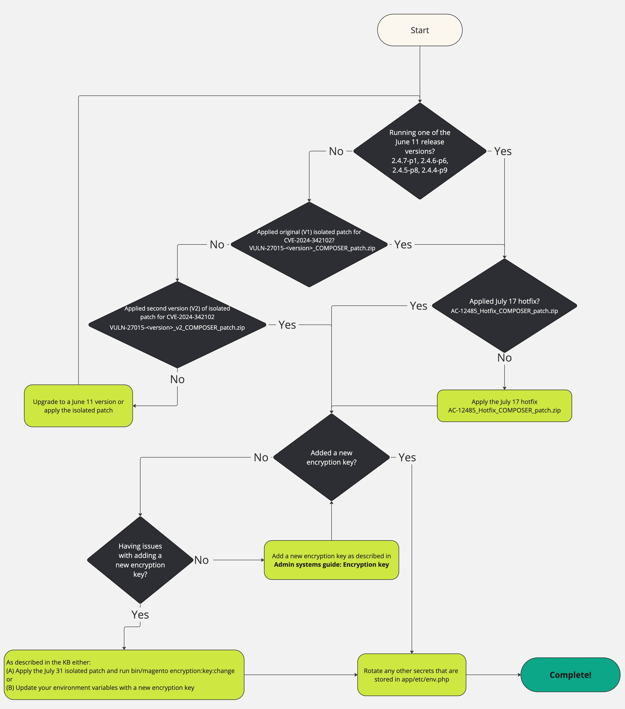

# Solucionando Problemas de Rotação de Chaves de Criptografia: [!DNL CVE-2024-34102]

O objetivo deste artigo é ajudar os comerciantes a solucionar problemas de rotação de chaves de criptografia depois de já terem seguido as etapas descritas neste [artigo](https://experienceleague.adobe.com/en/docs/commerce-knowledge-base/kb/troubleshooting/known-issues-patches-attached/security-update-available-for-adobe-commerce-apsb24-40-revised-to-include-isolated-patch-for-cve-2024-34102) em [!DNL CVE-2024-34102].

Se você já seguir as etapas do artigo acima e tiver problemas ao girar suas chaves de criptografia, temos um patch isolado para ajudar a resolver possíveis problemas.

Para ajudar a ilustrar as etapas que foram comunicadas e resumidas anteriormente, para proteger contra [!DNL CVE-2024-34102], bem como as soluções de problemas adicionais encontradas abaixo, você também pode utilizar este fluxograma:


{zoomable="yes"}


## Como aplicar o patch isolado para executar o novo comando

Descompacte o arquivo e consulte [Como aplicar um patch de compositor fornecido pelo Adobe](https://experienceleague.adobe.com/docs/commerce-knowledge-base/kb/how-to/how-to-apply-a-composer-patch-provided-by-magento.html) em nossa base de dados de suporte para obter instruções.

## Adicionar uma nova chave de criptografia sem usar variáveis de ambiente

O comportamento padrão do aplicativo é armazenar a chave de criptografia no arquivo `app/etc/env.php`.

As [etapas descritas na documentação](https://experienceleague.adobe.com/en/docs/commerce-admin/systems/security/encryption-key) descrevem como alterar essa chave dentro desse arquivo usando a interface [!UICONTROL Admin].

As etapas e o patch isolado fornecidos nesta seção permitem que você altere facilmente o valor desse arquivo e permitirão que você solucione os problemas que podem estar ocorrendo na interface [!UICONTROL Admin].

No entanto, a maneira mais fácil e segura de gerenciar a chave de criptografia é usar variáveis de ambiente. Se você já estiver usando variáveis de ambiente ou estiver interessado em usá-las para gerenciar essa chave, há uma seção separada que descreve essas etapas.

## Produtos e versões afetados

Adobe Commerce na nuvem, Adobe Commerce no local e Magento Open Source:

* 2.4.7-p1 e anterior
* 2.4.6-p6 e anterior
* 2.4.5-p8 e anterior
* 2.4.4-p9 e anterior

## Patch Isolado para Solucionar Problemas de Detalhes de Rotação de Chave de Criptografia

Use os seguintes patches anexados, dependendo da sua versão do Adobe Commerce/Magento Open Source:

### Para a versão 2.4.7, 2.4.7-p1:

* [ac-12589-2-4-7x-composer-patch.zip](assets/ac-12589-2-4-7x-composer-patch.zip)

### Para as versões 2.4.6, 2.4.6-p1, 2.4.6-p2, 2.4.6-p3, 2.4.6-p4, 2.4.6-p5, 2.4.6-p6:

* [ac-12589-2-4-6x-composer-patch.zip](assets/ac-12589-2-4-6x-composer-patch.zip)

### Para as versões 2.4.5, 2.4.5-p1, 2.4.5-p2, 2.4.5-p3, 2.4.5-p4, 2.4.5-p5, 2.4.5-p6, 2.4.5-p7, 2.4.5-p8:

* [ac-12589-2.4.5x_COMPOSER_patch.zip](assets/ac-12589-2-4-5x-composer-patch.zip)

### Para as versões 2.4.4, 2.4.4-p1, 2.4.4-p2, 2.4.4-p3, 2.4.4-p4, 2.4.4-p5, 2.4.4-p6, 2.4.4-p7, 2.4.4-p8, 2.4.4-p9:

* [ac-12589-2-4-4x-composer-patch.zip](assets/ac-12589-2-4-4x-composer-patch.zip)


Após instalar o patch isolado, altere a chave de criptografia ativa com o novo comando [!DNL CLI].

>[!NOTE]
>
>**Este novo comando [!DNL CLI] acionará uma limpeza de cache na execução.**

1. Esse novo comando deve ser executado no ambiente que contém o arquivo `app/etc/env.php` para a chave que você deseja atualizar.
1. Confirme se o novo comando existe:

   ```
   bin/magento list | grep encryption:key:change
   ```

   Você deve ver a seguinte saída:

   ```
   encryption:key:change Change the encryption key inside the env.php file.
   ```

1. Altere a chave de criptografia:

   ```
   bin/magento encryption:key:change
   ```

1. Se você executou esse comando no sistema de produção, nenhuma outra ação deverá ser necessária.
Se você tiver executado isso em um sistema de desenvolvimento, **deverá** inserir essa alteração no sistema de produção, pois normalmente implantaria configurações confidenciais.

## Atualize a chave de criptografia usando variáveis de ambiente em vez de usar o patch isolado

Como alternativa à seção acima, essas etapas permitirão adicionar uma nova chave de criptografia, preservando os dados criptografados existentes, mesmo que você esteja usando o `app/etc/env.php` padrão no momento.
**Esta seção se aplica ao Adobe Commerce na Nuvem e ao Cloud Starter, mas também se aplica ao Adobe Commerce no local**, embora as etapas e os locais exatos das variáveis dependam de sua infraestrutura.

### Colete seu valor atual

* Se você já estiver gerenciando suas chaves com variáveis de ambiente, talvez ela esteja em [vários locais possíveis](https://experienceleague.adobe.com/en/docs/commerce-cloud-service/user-guide/configure/env/stage/variables-intro), mas provavelmente estará na variável [`CRYPT_KEY`](https://experienceleague.adobe.com/en/docs/commerce-cloud-service/user-guide/configure/env/stage/variables-deploy#crypt_key), conforme descrito na documentação.
* Se você não estiver usando variáveis, a chave de criptografia estará em `app/etc/env.php` dentro da chave de dados `crypt/key`.

Em ambos os casos, pode ser um valor multilinha e conter vários itens com o prefixo `base64`.

### Gerar uma nova chave

As chaves de criptografia são 32 bytes de dados aleatórios que são codificados com [!DNL base64] e prefixados com `base64`.
Para gerar uma nova chave:

1. Usando a ferramenta de sua escolha, gere 32 bytes aleatórios de dados codificados com [!DNL base64]. Por exemplo, usando o [!DNL OpenSSL CLI], você pode executar `openssl rand -base64 32`, mas qualquer ferramenta de geração aleatória criptograficamente confiável pode ser usada.
1. Prefixe esse valor com `base64`. Por exemplo, se a saída do comando `openssl` *ABC123*, o valor se tornaria: *base64ABC123*

### Crie o novo valor

Anexe o valor gerado ao seu valor existente que você coletou acima. Por exemplo, se o valor existente for *base64HelloWorld*, o novo valor se tornará:<br>

```
base64HelloWorld
base64ABC123
```

### Adicionar uma nova variável de ambiente

Use o [[!UICONTROL Cloud Console] ou  [!DNL magento-cloud CLI]](https://experienceleague.adobe.com/en/docs/commerce-cloud-service/user-guide/configure/env/variable-levels) para definir a `env:MAGENTO_DC_CRYPT__KEY` [variável de ambiente](https://experienceleague.adobe.com/en/docs/commerce-cloud-service/user-guide/configure/env/stage/variables-cloud) para esse novo valor.

>[!NOTE]
>
>Observe que, se você optar por marcar a variável como *confidencial*, convém salvar um backup externo desse valor, pois ele ficará oculto em todas as interfaces e só ficará visível para o aplicativo.

Ao salvar a variável, uma reimplantação será acionada automaticamente, o que fará com que o valor seja aplicado.

## Atualizações de segurança

Atualizações de segurança relacionadas disponíveis para o Adobe Commerce:

* [Atualização de segurança disponível para o Adobe Commerce - APSB24-40](https://experienceleague.adobe.com/en/docs/commerce-knowledge-base/kb/troubleshooting/known-issues-patches-attached/security-update-available-for-adobe-commerce-apsb24-40-revised-to-include-isolated-patch-for-cve-2024-34102)
* [Boletim de Segurança de Adobe ([!DNL APSB24-40])](https://helpx.adobe.com/security/products/magento/apsb24-40.html)
