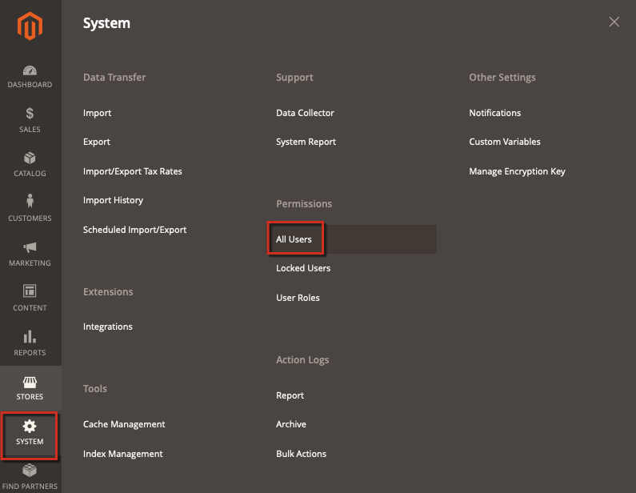

# Senhas de administrador salvas como texto sem formatação no log de ações

Este artigo fornece uma correção para quando um Administrador do Commerce cria um novo usuário com privilégios de Administrador e a senha é salva como texto sem formatação na `magento_logging_event_changes` tabela de banco de dados.

Para corrigir esse problema de segurança, instale a Atualização de segurança do Adobe Commerce 2.0.16 e 2.1.9. Após aplicar a Atualização de segurança, as senhas são criptografadas e não aparecem como texto simples.

## Versões afetadas {#Adminpasswordsaresavedasplaintexttoactionslog('magento_logging_event_changes'table)-Affectedversions}

* Adobe Commerce no local 2.X.X
* Adobe Commerce na infraestrutura em nuvem 2.X.X

## Problema {#Adminpasswordsaresavedasplaintexttoactionslog('magento_logging_event_changes'table)-Issue}

Quando um Administrador existente do Commerce cria um novo usuário com privilégios de Administrador via **Sistema** > **Permissões** > **Todos os usuários** > **Adicionar novo usuário**, a senha (inserida como confirmação) será salva como texto sem formatação na `magento_logging_event_changes` tabela de banco de dados.

### Etapas a serem reproduzidas: {#Adminpasswordsaresavedasplaintexttoactionslog('magento_logging_event_changes'table)-Stepstoreproduce}

1. Faça logon como Administrador e crie um novo usuário navegando até este caminho: **Sistema** > Permissões > **Todos os usuários**.

   

1. Em seguida, clique no link **Adicionar novo usuário** página. Quando solicitado, forneça sua senha de administrador atual.
1. Vá para a **Sistema** > **Log de ação** > **Relatório** e localize a última entrada de log.
1. Você pode ver a senha atual, não criptografada nem com hash.

## Solução {#Adminpasswordsaresavedasplaintexttoactionslog('magento_logging_event_changes'table)-Solution}

Instalação do [Atualização de segurança do Adobe Commerce 2.0.16 e 2.1.9](https://magento.com/security/patches/magento-2016-and-219-security-update) corrige esse problema.

Após instalar a Atualização de segurança, a senha é criptografada e não é exibida em texto sem formatação na `magento_logging_event_changes` tabela.

## Mais informações {#Adminpasswordsaresavedasplaintexttoactionslog('magento_logging_event_changes'table)-Moreinformation}

[Página Atualização de segurança do Adobe Commerce 2.0.16 e 2.1.9](https://magento.com/security/patches/magento-2016-and-219-security-update) em nosso centro de segurança.

[Atualizar o aplicativo e os componentes do Adobe Commerce](https://experienceleague.adobe.com/docs/commerce-operations/upgrade-guide/overview.html) na documentação do desenvolvedor.
