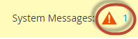

# Problemas de verificação de preparação do Cron

Este artigo fornece soluções para problemas de preparação do cron. A seguir estão os sintomas de problemas de cron:

* Uma mensagem de erro sobre a configuração `$HTTP_RAW_POST_DATA` do PHP é exibida mesmo se estiver definida corretamente.
* A verificação de preparação do PHP não exibe a versão do PHP como mostra a figura a seguir:
  
* O seguinte erro é exibido no Commerce Admin:
  
Para ver o erro, talvez seja necessário clicar em **Mensagens do Sistema** na parte superior da janela da seguinte maneira:
  

## Verifique seu crontab existente {#check-your-existing-crontab}

Esta seção discute como ver se o CRON está em execução no momento e verificar se está configurado corretamente.

Para verificar se o crontab está configurado ou não:

1. Faça logon no servidor Commerce como ou alterne para o [proprietário do sistema de arquivos Magento](https://experienceleague.adobe.com/en/docs/commerce-operations/installation-guide/prerequisites/file-system/overview).
1. Verifique se o seguinte arquivo existe: `$ ls -al <magento_root>/var/.setup_cronjob_status`. Se o arquivo existir, o cron foi executado com sucesso no passado. Se o arquivo *não* existir, você ainda não instalou o Adobe Commerce ou o cron não está em execução. Em ambos os casos, continue com a próxima etapa.
1. Obtenha mais detalhes sobre cron. Como usuário com privilégios `root`, digite o seguinte comando: `$ crontab -u <Magento file system owner name> -l`. Por exemplo, no CentOS `$ crontab -u magento_user -l`. Se nenhum crontab tiver sido configurado para o usuário, a seguinte mensagem será exibida:    `no crontab for magento_user`. Seu crontab lhe diz o seguinte:
   * Qual binário PHP você está usando (em alguns casos, você tem mais de um)
   * Quais scripts cron do Adobe Commerce você está executando (especificamente, os caminhos para esses scripts)
   * Onde estão localizados os logs CRON

   Consulte uma das seções a seguir para obter uma solução para o seu problema.

## Solução: crontab não está configurado {#solution-crontab-not-set-up}

Para verificar se os trabalhos cron estão configurados corretamente, consulte [Configurar trabalhos cron](https://experienceleague.adobe.com/en/docs/commerce-operations/installation-guide/next-steps/configuration) na documentação do desenvolvedor.

## Solução: cron executando a partir de binário PHP incorreto {#solution-cron-running-from-incorrect-php-binary}

Se o seu trabalho cron usa um binário PHP diferente do plug-in do servidor Web, erros de configuração de PHP podem ser exibidos. Para resolver o problema, defina configurações idênticas do PHP para a linha de comando do PHP e o plug-in do servidor Web PHP.

Para obter mais informações sobre as configurações do PHP, consulte [Configurações do PHP necessárias](https://experienceleague.adobe.com/en/docs/commerce-operations/installation-guide/prerequisites/php-settings) na documentação do desenvolvedor.

## Solução: cron em execução com erros {#solution-cron-running-with-errors}

Tente executar cada comando manualmente porque o comando pode exibir mensagens de erro úteis. Consulte [Configurar trabalhos do cron](https://experienceleague.adobe.com/en/docs/commerce-operations/installation-guide/next-steps/configuration) na documentação do desenvolvedor.

>[!NOTE]
>
>Você deve executar o cron pelo menos *duas vezes* para que o trabalho seja executado; na primeira vez para colocar trabalhos em fila e na segunda vez para executá-los.
