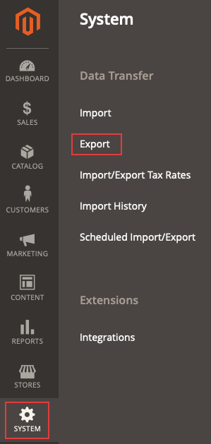

# O arquivo .csv de produtos exportados não é exibido

Este artigo fornece uma correção para o problema em que você tenta exportar produtos para um arquivo .csv no Administrador do Commerce, mas o arquivo não é exibido.

## Produtos e versões afetados

* Adobe Commerce na infraestrutura em nuvem, todas as [versões com suporte](https://magento.com/sites/default/files/magento-software-lifecycle-policy.pdf).

## Problema

<u>Etapas a serem reproduzidas</u>

Pré-requisitos: a opção **Adicionar Chave Secreta às URLs** está definida como *Sim*. A opção está configurada no Administrador do Commerce em **Lojas** > **Configuração** > **Avançado** > **Administrador** > **Segurança**.

1. No Administrador, navegue até **Sistema** > **Transferência de Dados** > **Exportar**.

   

1. Selecionar
   * **Tipo de entidade**: *Produtos*
   * **Formato de Arquivo de Exportação**: *CSV*
   * **Compartimento de Campo**: deixe desmarcado.
1. Clique em **Continuar**.
1. A seguinte mensagem é exibida: *&quot;A mensagem foi adicionada à fila; aguarde para obter seu arquivo em breve&quot;*.

<u>Resultado esperado</u>

O arquivo .csv com os produtos exportados é exibido na grade em alguns minutos.

<u>Resultado real</u>

O arquivo .csv com os produtos exportados não é exibido na grade em 10 minutos ou mais.

## Causa

Um problema conhecido com a funcionalidade Exportar na versão 2.3.2 do componente do aplicativo Adobe Commerce.

## Solução

Há duas soluções possíveis para o problema:

* Desative a opção Adicionar chave secreta ao URL.
* Execute o comando `bin/magento queue:consumers:start exportProcessor` manualmente e, opcionalmente, configure-o para ser executado pelo cron.

Veja detalhes para ambas as opções nos parágrafos a seguir.

### Desativar a opção Adicionar chave secreta ao URL

1. No Administrador, navegue até **Lojas** > **Configuração** > **Avançado** > **Administrador** > **Segurança**.
1. Defina a opção **Adicionar Chave Secreta às URLs** como *Não.*
1. Clique em **Salvar configuração**.
1. Limpar cache em **Sistema** > **Ferramentas** > **Gerenciamento de Cache** ou executando    ```bash    bin/magento cache:clean``` ou no Administrador.

### Execute o comando de exportação manualmente e, opcionalmente, adicione-o como um trabalho cron

Para obter o arquivo de exportação, execute o comando `bin/magento queue:consumers:start exportProcessor`. Depois de executar isso, o arquivo deve ser exibido na grade.


Para adicionar o processo como um trabalho cron opcionalmente, você deve adicionar a variável `CRON_CONSUMERS` ao arquivo `.magento.env.yaml`.

#### Adicionar processo como um trabalho cron (opcional)

1. Verifique se o cron está configurado e configurado. Consulte [Configurar trabalhos cron](/docs/commerce-cloud-service/user-guide/configure/app/properties/crons-property.html) para obter detalhes.
1. Execute o seguinte comando para retornar uma lista de consumidores da fila de mensagens:     `./bin/magento queue:consumers:list`
1. Adicione o seguinte ao arquivo `.magento.env.yaml` no diretório raiz do aplicativo e inclua os consumidores que deseja adicionar. Por exemplo, este é o consumidor necessário para o processamento da exportação:

   ```yaml
   stage:
       deploy:
           CRON_CONSUMERS_RUNNER:
               cron_run: true
               max_messages: 1000
               consumers:
                   - exportProcessor
   ```

   Em seguida, envie esse arquivo atualizado e reimplante seu ambiente. Também consulte [Adicionar trabalhos cron personalizados ao seu projeto](/docs/commerce-cloud-service/user-guide/configure/app/properties/crons-property.html#add-custom-cron-jobs-to-your-project) em nossa documentação do desenvolvedor.

>[!NOTE]
>
>Se você não conseguir encontrar o arquivo `.magento.env.yaml` para seu ambiente e achar que ele foi excluído, precisará criar um novo `.magento.env.yaml`. Inicialmente, pode estar em branco. Você pode adicionar informações lá, conforme necessário. Consulte os seguintes artigos: [Configurar variáveis de ambiente para implantação](/docs/commerce-cloud-service/user-guide/configure/env/configure-env-yaml.html) e [Variáveis de ambiente](/docs/commerce-cloud-service/user-guide/configure/env/stage/variables-intro.html) na documentação do desenvolvedor.

>[!TIP]
>
>[Arquivos YAML](https://experienceleague.adobe.com/docs/commerce-cloud-service/user-guide/configure/env/configure-env-yaml.html) diferenciam maiúsculas de minúsculas e não permitem guias. Tenha cuidado para usar recuo consistente em todo o arquivo .magento.env.yaml ou sua configuração pode não funcionar como esperado. Os exemplos na documentação e no arquivo de amostra usam recuo de dois espaços. Use o comando ece-tools validate para verificar sua configuração.

>[!NOTE]
>
>Nos projetos Pro do Adobe Commerce on cloud infrastructure, o [recurso de autocronagem](/docs/commerce-cloud-service/user-guide/configure/app/properties/crons-property.html?lang=en#crontab) deve estar habilitado na infraestrutura do Adobe Commerce on cloud antes que você possa adicionar trabalhos cron personalizados aos ambientes de preparo e produção usando o `.magento.app.yaml`. Se este recurso não estiver habilitado, [crie um tíquete de suporte](/help/help-center-guide/help-center/magento-help-center-user-guide.md#submit-ticket), para que o trabalho seja adicionado para você.
