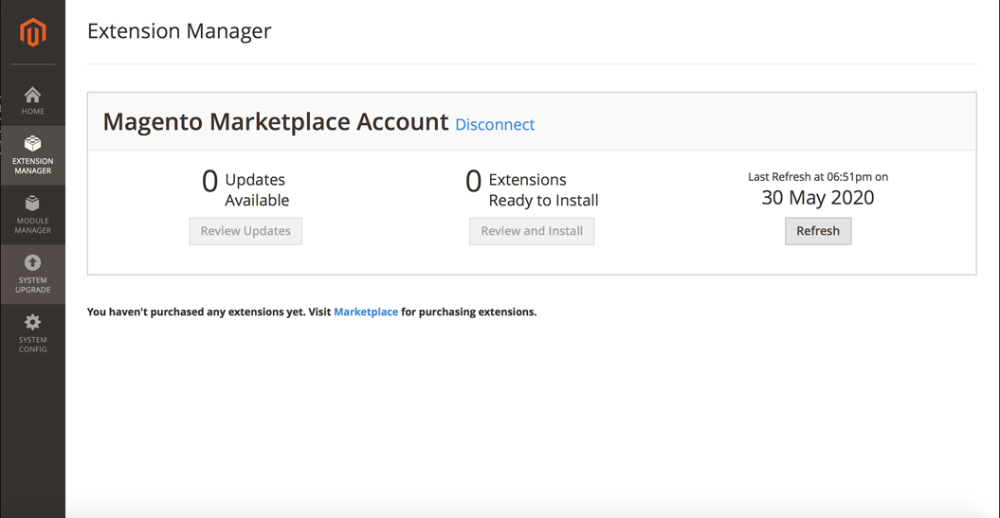

# O Extension Manager não mostra extensões no Adobe Commerce 2.3.x

Este artigo fornece uma solução alternativa para as extensões ausentes no Extension Manager de Admin no Adobe Commerce 2.3.x após comprar as extensões pelo Commerce Marketplace.

## Produtos e versões afetados

* Versão do Adobe Commerce (todos os métodos de implantação) 2.3.x

## Problema

Ao comprar extensões por meio do Commerce Marketplace, não é possível instalá-las usando o Extension Manager principal do Adobe Commerce. Quando você adiciona suas chaves de acesso e sincroniza com o Marketplace, o Extension Manager não mostra extensões.

A variável **Solução alternativa** o problema é usar a linha de comando instalação do Adobe Commerce, como mostrado na [Instalação geral da CLI](https://devdocs.magento.com/extensions/install/) na documentação do desenvolvedor.

<u>Etapas a serem reproduzidas</u>:

1. Adquira uma extensão por meio do Commerce Marketplace.
1. Adicione as chaves de acesso da extensão e sincronize com o Marketplace.
1. Acesse a seção Extension Manager do Administrador.

<u>Resultado esperado</u>:

A extensão é exibida na seção Extension Manager do Administrador do Commerce.

<u>Resultado real</u>:

**Nenhuma extensão é exibida na seção Extension Manager do Commerce Admin, semelhante à imagem abaixo:**

## Solução alternativa

Use a linha de comando para instalação do Adobe Commerce, conforme mostrado na [Instalação geral da CLI](https://devdocs.magento.com/extensions/install/) na documentação do desenvolvedor.
