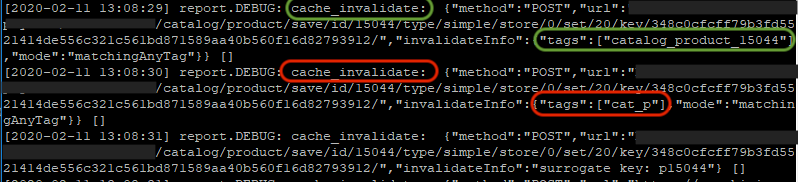

# O cache invalidado causa degradação do tempo de resposta

Este artigo fornece uma solução sobre como evitar a invalidação de cache, o que pode causar o desempenho lento de uma loja da Adobe Commerce.

PRODUTOS E VERSÕES AFETADOS:

* Adobe Commerce no local 2.2.x, 2.3.x
* Adobe Commerce na infraestrutura em nuvem 2.2.x, 2.3.x

## Problema

Resposta lenta do site.

## Causa

Um longo tempo de resposta pode ser causado pela invalidação (liberação) do cache.

O cache é usado para gerar respostas rápidas para as solicitações dos visitantes do site. Se não houver dados de cache apropriados disponíveis, o aplicativo do Adobe Commerce buscará os dados do banco de dados, calculará e agregará os dados e os armazenará no armazenamento em cache. O processo de geração de cache requer recursos de sistema adicionais, causando degradação total do tempo de resposta.

Há dois tipos de cache no Adobe Commerce:

1. Interno:
   * armazena dados no servidor
   * armazena dados específicos (configuração, detalhes do produto, detalhes da categoria etc.)
1. Externo:
   * CDN ou verniz (no caso do Adobe Commerce na infraestrutura em nuvem — Fastly CDN)
   * armazena páginas completas já geradas. Por exemplo, catálogo/categoria, páginas de catálogo/produto e assim por diante.

### Verifique se o cache foi invalidado

Você pode encontrar informações sobre os tipos de cache invalidados no arquivo `<install_directory>/var/log/debug.log`.

Para fazer isso:

1. Abrir `<install_directory>/var/log/debug.log`
1. Procure a mensagem &quot; *cache\_invalidate* &quot;.
1. Em seguida, verifique a tag especificada. Indica qual cache foi liberado. Você pode ter problemas devido ao cache invalidado se vir uma tag sem uma ID de entidade específica especificada, por exemplo:
   * `cat_p` - significa cache de produto de catálogo.
   * `cat_c` - cache de categoria de catálogo.
   * `FPC` - cache de página inteira.
   * `CONFIG` - cache de configuração.

   Mesmo que um deles fosse liberado, a resposta do site ficaria mais lenta. Se a marca contiver uma ID de entidade, por exemplo, `category_product_1258`, isso indicará o cache de um produto ou categoria específica, e assim por diante. A liberação do cache para um produto ou categoria específica não causaria uma queda significativa do tempo de resposta.

A seguir está uma amostra de um `debug.log` que contém registros sobre o cache `cat_p` e `category_product_15044` que foram liberados:

Normalmente, o cache é invalidado devido ao seguinte:

* Reindexação completa.
* Flash do cache da CLI, manualmente ou usando o cron.

## Recomendação

1. Evite liberar o cache da CLI do Commerce.
1. Configure indexadores para **Atualizar por agendamento** em vez de **Atualizar no modo de salvamento**, pois o último aciona a reindexação completa. Para referência, consulte [Gerenciar os indexadores > Configurar indexadores](https://devdocs.magento.com/guides/v2.3/config-guide/cli/config-cli-subcommands-index.html#configure-indexers) na documentação do desenvolvedor.
