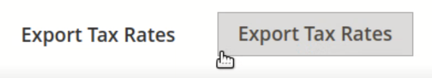

# Problema conhecido do Adobe Commerce 2.4.0 - as Taxas de imposto de exportação não funcionam

Este artigo fornece uma solução para um problema conhecido do Adobe Commerce 2.4.0 em que **Exportar Alíquotas de Imposto** não funciona.

## Produtos e versões afetados

* Adobe Commerce na infraestrutura em nuvem 2.4.0
* Adobe Commerce no local 2.4.0

## Problema

<u>Etapas a serem reproduzidas:</u>

1. Acesse o Painel de administração do Commerce > **Lojas** > **Regras de Imposto**.
1. Clique em **Adicionar Nova Regra de Imposto** botão.
1. Clique no texto da **Exportar Alíquotas de Imposto** botão.

   

<u>Resultado esperado</u>:

A `tax_rates.csv` downloads de arquivo contendo taxas de imposto.

<u>Resultado real</u>:

Nenhum arquivo .csv foi baixado.

## Solução

Solução alternativa:

Clique em na borda inferior esquerda do **Exportar Alíquotas de Imposto** botão para exportar o `tax_rates.csv` arquivo.

Há planos de que o problema seja resolvido em um patch 2.4.1.

## Leitura relacionada

Em nossa base de conhecimento de suporte:

* [Problema conhecido do Adobe Commerce 2.4.0: os métodos de pagamento de Braintree não são exibidos na finalização de vários endereços](/help/troubleshooting/payments/magento-2-4-0-braintree-not-in-multiple-addresses-checkout.md).
* [Problema conhecido na criação de etiquetas de remessa no Adobe Commerce 2.4.0](/help/troubleshooting/known-issues-patches-attached/shipping-labels-creation-known-issue-in-magento-2-4-0.md).
* [Problema conhecido do Adobe Commerce 2.4.0: a atualização das Atividades do cliente não funciona](/help/troubleshooting/miscellaneous/magento-2-4-0-refresh-on-customer-activities-does-not-work.md).
* [Problema conhecido do Adobe Commerce 2.4.0: exibição de dados de mensagens brutas na loja](/help/troubleshooting/storefront/magento-2-4-0-issue-storefront-raw-message-data-display.md).
* [Problema conhecido do Adobe Commerce 2.4.0: o botão &quot;Adicionar seleções ao carrinho&quot; não funciona](/help/troubleshooting/miscellaneous/magento-2-4-0-add-selections-to-my-cart-does-not-work.md).
