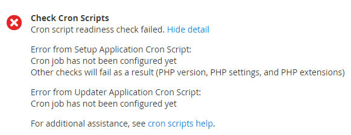

# Solução de problemas do CRON

Este artigo oferece soluções de problemas com o cron em produtos Adobe Commerce no local.

## Produtos e versões afetados

* Adobe Commerce no local 2.2.x, 2.3.x
* Magento Open Source 2.2.x, 2.3.x

## Problemas

## A seguir estão os sintomas de problemas de cron:

* Sua atualização nunca é executada; ela permanece em um estado `pending`.
* Uma mensagem de erro sobre a configuração `$HTTP_RAW_POST_DATA` do PHP é exibida mesmo se estiver definida corretamente.
* Falha na verificação de preparação do cron. Os possíveis erros incluem caminhos não graváveis e cron não configurado. Um exemplo é o seguinte:

  

* A verificação de preparação do PHP não exibe a versão do PHP como mostra a figura a seguir.

  

* O seguinte erro é exibido no Commerce Admin:

  

Para ver o erro, talvez seja necessário clicar em **Mensagens do Sistema** na parte superior da janela da seguinte maneira:

## Investigue para encontrar a causa {#check-your-existing-crontab}

Esta seção discute como ver se o cron está em execução no momento e como verificar se ele está configurado corretamente.

Para verificar se o crontab está ou não configurado, siga estas etapas:

1. Faça logon no servidor Magento como, ou alterne para, o [proprietário do sistema de arquivos Magento](https://experienceleague.adobe.com/en/docs/commerce-operations/installation-guide/prerequisites/file-system/overview).
1. Consulte se o seguinte arquivo existe:    `bash    ls -al <magento_root>/var/.setup_cronjob_status`. Se o arquivo existir, o cron foi executado com sucesso no passado. Se o arquivo *não* existir, você ainda não instalou o Magento ou o cron não está em execução. Em ambos os casos, continue com a próxima etapa.
1. Obtenha mais detalhes sobre cron. Como um usuário com privilégios `root`, digite o seguinte comando:    `bash    crontab -u <Magento file system owner name> -l`. Por exemplo, no CentOS `bash    crontab -u magento_user -l`.  Se nenhum crontab tiver sido configurado para o usuário, a seguinte mensagem será exibida:    `terminal    no crontab for magento_user`. Seu crontab lhe diz o seguinte:

   * Qual binário PHP você está usando (em alguns casos, você tem mais de um)
   * Quais scripts Magento cron você está executando (especificamente, os caminhos para esses scripts)
   * Onde estão localizados os logs CRON

Consulte uma das seções a seguir para obter uma solução para o seu problema.

## Soluções

### Solução para crontab não está sendo configurada {#solution-crontab-not-set-up}

Para verificar se os trabalhos cron estão configurados corretamente, consulte [Configurar trabalhos cron](https://experienceleague.adobe.com/en/docs/commerce-operations/installation-guide/next-steps/configuration).

### Solução para cron executado a partir de binário PHP incorreto {#solution-cron-running-from-incorrect-php-binary}

Se o seu trabalho cron usa um binário PHP diferente do plug-in do servidor Web, erros de configuração de PHP podem ser exibidos. Para resolver o problema, defina configurações idênticas do PHP para a linha de comando do PHP e o plug-in do servidor Web PHP.

Para obter mais informações sobre as configurações do PHP, consulte [Configurações do PHP necessárias](https://experienceleague.adobe.com/en/docs/commerce-operations/installation-guide/prerequisites/php-settings) na documentação do desenvolvedor.

### Solução para cron em execução com erros {#solution-cron-running-with-errors}

Tente executar cada comando manualmente porque o comando pode exibir mensagens de erro úteis. Consulte [Configurar trabalhos cron](https://experienceleague.adobe.com/en/docs/commerce-operations/installation-guide/next-steps/configuration).

>[!NOTE]
>
>Você deve executar o cron pelo menos *duas vezes* para que o trabalho seja executado; na primeira vez para colocar trabalhos em fila e na segunda vez para executá-los.
