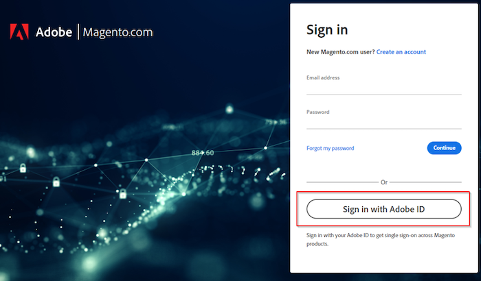

# Não é possível fazer logon no suporte da Adobe Commerce ou na conta da nuvem

Este artigo fornece uma solução para quando você luta para fazer logon no suporte da Adobe Commerce ou no seu projeto na nuvem.

## Produtos e versões afetados

Adobe Commerce (todos os métodos de implantação) todas as [versões com suporte](https://www.adobe.com/content/dam/cc/en/legal/terms/enterprise/pdfs/Adobe-Commerce-Software-Lifecycle-Policy.pdf)

## Problema

Ao acessar [https://account.magento.com/customer/account/login/](https://account.magento.com/customer/account/login/) ou [https://accounts.magento.cloud/user](https://accounts.magento.cloud/user), você poderá notar que agora há um formulário de logon unificado e que não é mais possível inserir suas credenciais como anteriormente.

<u>Etapas a serem reproduzidas</u>:

Tente fazer logon em sua conta da Commerce.

<u>Resultado esperado</u>:

Logon realizado com sucesso.

<u>Resultado real</u>:

Receba o redirecionamento para uma página para entrar com uma conta Adobe e as credenciais não funcionarão.

## Causa

Como parte do nosso processo de integração do Adobe Commerce com outras soluções de Adobe, todos os usuários precisarão criar um logon de Adobe (caso ainda não tenham um) usando o mesmo endereço de email conectado à sua MageID.

## Solução

Você pode fazer logon na conta com:

- Uma conta Adobe existente corporativa/pessoal.
- Se você não tiver uma conta Adobe, crie uma com o mesmo endereço de email.

Para ver as etapas, consulte o [Commerce Identity Manager](https://experienceleague.adobe.com/docs/commerce-admin/start/commerce-account/commerce-identity-manager.html) no Adobe Experience League.

## Leitura relacionada

- [Link Magento.com e logons de conta do accounts.magento.cloud](/help/faq/general/linking-magento-com-and-accounts-magento-cloud-account-logins.md)
