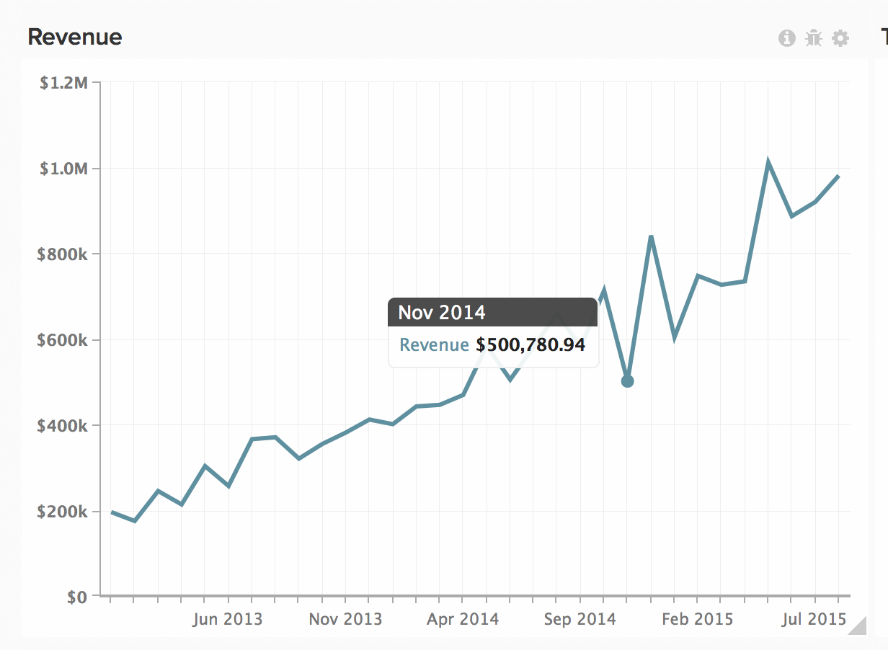
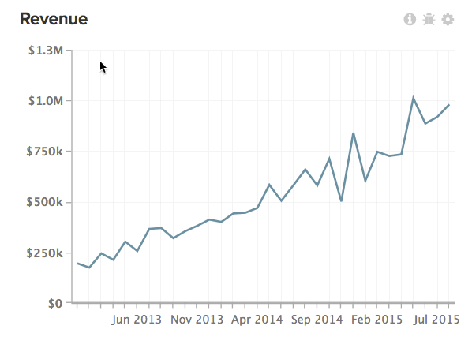

# Uso de Exportações de Dados para apontar discrepâncias

Este artigo fornece soluções para discrepâncias de solução de problemas nos dados de Magento BI. As Exportações de Dados são uma ferramenta útil para comparar seus dados do Magento BI com seus dados de origem para apontar discrepâncias de dados em seus relatórios, especialmente se a [lista de verificação de diagnóstico de discrepância de dados](/help/troubleshooting/miscellaneous/diagnosing-a-data-discrepancy.md) não ajudou a identificar o problema. Este artigo o guiará por um exemplo real de como as discrepâncias de dados podem ser identificadas usando as Exportações de dados.

Faça esta análise, por exemplo:

Há um declínio suspeito em novembro de 2014. US$ 500.780,94 de receita? Isso não parece certo. Você confirmou que há mais receita sendo exibida para o mês de novembro de 2014 no banco de dados de origem e verificou novamente se a métrica **Receita** usada neste relatório está definida corretamente. Parece que os dados no data warehouse do Magento BI estão incompletos, o que pode ser confirmado por meio de uma Exportação de dados.

## Exportação dos dados {#export}

Para começar, clique na engrenagem no canto superior direito do gráfico e, em seguida, na opção Exportação bruta no menu suspenso. Isso fornecerá uma exportação bruta dos dados por trás do gráfico.

No menu Exportação de dados brutos, você pode selecionar a tabela da qual exportar, juntamente com as colunas a serem incluídas na exportação. Os filtros também podem ser aplicados ao conjunto de resultados.

Em nosso exemplo, a métrica **Receita** usada neste relatório usa o campo **ordem\_total** definido na tabela **ordens**, usando a **data** como carimbo de data/hora. Em nossa exportação, queremos incluir todos os valores **order\_id** de novembro de 2014 e seus **order\_total** . A métrica **Receita** não usa nenhum filtro, mas adicionaremos um filtro à exportação para limitar o conjunto de resultados a novembro de 2014.

Aqui está a aparência do menu Exportação de Dados Brutos para este exemplo:

Clique em Exportar dados para iniciar a exportação. Uma janela com os detalhes da exportação, incluindo o status, será exibida. A preparação da exportação leva alguns minutos, o que torna a execução de uma extração análoga de nossos dados de origem para novembro de 2014, incluindo **date, order\_id** e o **order\_total** . Abriremos esse arquivo no Excel e o deixaremos aberto, pois voltaremos a ele em breve.

Quando o botão Download for exibido na janela Exportações de dados brutos, clique nele para baixar o arquivo zip que contém o arquivo CSV.

Neste ponto, precisamos obter todos os dados em uma planilha para encontrar o problema. Importaremos o arquivo CSV (a exportação do Magento BI) para uma planilha diferente do arquivo do Excel que contém nossos dados de origem.

## Identificando o problema {#pinpoint}

Agora que todos os dados estão em um só lugar, podemos procurar a fonte da discrepância. Comparar o número de linhas em cada planilha nos ajudará a identificar o problema. Vamos analisar mais detalhadamente cada situação.

### Ambas as planilhas contêm o mesmo número de linhas

Se ambos os sistemas tiverem a mesma contagem de linhas e a métrica **Receita** não corresponder aos dados de origem, a **ordem\_total** deverá estar desativada em algum lugar. É possível que o campo **ordem\_total** tenha sido atualizado no banco de dados de origem e o Magento BI não esteja coletando essas alterações.

Para confirmar isso, verifique se a coluna **order\_total** está ou não sendo verificada novamente. Vá até o Gerente de Data Warehouse e clique na tabela pedidos. Você verá a [frequência de reverificação](https://experienceleague.adobe.com/docs/commerce-business-intelligence/mbi/analyze/warehouse-manager/cfg-data-rechecks.html) listada em &#39;Alterações?&#39; coluna. O campo **order\_total** deve ser definido para verificar novamente com a frequência esperada; caso contrário, vá em frente e defina-o com a frequência de verificação desejada.

### 

Se a frequência de reverificação já estiver definida corretamente, algo mais estará errado. Consulte a [seção Entrando em contato com o suporte](#support) no final deste artigo para obter as próximas etapas.

## O banco de dados de origem tem MAIS linhas do que o Magento BI {#morerows}

Se o banco de dados de origem tiver mais linhas do que Magento BI e a lacuna for maior do que o número de pedidos que você pode esperar durante a duração de um ciclo de atualização, pode haver um problema de conexão. Isso significa que o Magento BI não pode extrair novos dados do banco de dados de origem, o que pode ocorrer por vários motivos.

Navegue até a página Conexões e verifique o status da fonte de dados que contém a tabela de pedidos:

1. **Se o status for Reautenticar**, a conexão não está usando as credenciais corretas. Clique na conexão, digite as credenciais corretas e tente novamente.
1. **Se o status for Falha** , a conexão pode não ser configurada corretamente no lado do servidor. Conexões com falha geralmente surgem de um nome de host incorreto ou o servidor de destino não aceita conexões na porta especificada. Clique na conexão e verifique novamente a ortografia do nome do host e se a porta correta foi inserida. No lado do servidor, verifique se a porta pode aceitar conexões e se seu firewall tem o endereço IP de Magento BI (54.88.76.97/32) conforme permitido. **Se a conexão continuar a falhar** , consulte a [seção de Contato com o Suporte](#support) no final deste artigo para obter as próximas etapas.
1. **Se o status for Êxito**, a conexão não é o problema e o suporte a RJ precisa se envolver. Consulte a [seção Entrando em contato com o suporte](#support) no final deste artigo para obter as próximas etapas.

## O banco de dados de origem tem MENOS linhas do que o Magento BI {#lessrows}

Se o banco de dados de origem tiver menos linhas do que o Magento BI, é possível que as linhas estejam sendo excluídas do banco de dados de origem e o Magento BI não esteja coletando essas exclusões. ** [A exclusão de dados](https://experienceleague.adobe.com/docs/commerce-business-intelligence/mbi/best-practices/data/opt-db-analysis.html) pode gerar discrepâncias, tempos de atualização mais longos e uma enxurrada de dores de cabeça com logística**. Portanto, recomendamos que você nunca exclua dados, a menos que seja realmente necessário.

No entanto, se as linhas forem excluídas da tabela, verifique a frequência de reverificação na chave primária. Verificar novamente a chave primária significa que a tabela será verificada em busca de linhas excluídas.

No Gerenciador de Datas Warehouse, as colunas de chave primária são marcadas com um símbolo de chave. No nosso exemplo, a chave primária é a coluna **order\_id**:

Se a chave primária já estiver definida para ser verificada novamente ou se as linhas nunca forem excluídas dessa tabela, será necessário suporte a RJ para apontar o problema. Consulte a seção a seguir para obter as próximas etapas.

## Contato com o suporte {#support}

Se você não puder identificar a origem do problema, precisará executar um loop no Suporte RJ. Antes de enviar um tíquete, faça o seguinte:

* **Se o banco de dados de origem e o Magento BI tiverem o mesmo número de linhas** e as frequências de reverificação estiverem definidas corretamente, execute um VLOOKUP na planilha **para descobrir quais valores order\_id têm um valor order\_total diferente entre o Magento BI e o banco de dados de origem.** Inclua esses valores ao enviar seu tíquete.
* **Se o banco de dados de origem tiver MAIS linhas do que o Magento BI** e a conexão for exibida como Bem-sucedida ou continuar a falhar, precisaremos saber o nome da conexão e a mensagem de erro que você está vendo, se houver.
* **Se o banco de dados de origem tiver MENOS linhas do que o Magento BI,** as linhas não serão excluídas da tabela e as frequências de reverificação estiverem definidas corretamente, execute um VLOOKUP na planilha **para descobrir quais valores de order\_id estão no Magento BI**, mas não no banco de dados de origem. Inclua esses valores ao enviar o tíquete.

## Relacionados

* [Lista de verificação de diagnóstico de discrepância de dados](/help/troubleshooting/miscellaneous/diagnosing-a-data-discrepancy.md)
* [Enviando um tíquete de discrepância de dados](https://support.magento.com/hc/en-us/articles/360016506472-Submitting-a-data-discrepancy-ticket)
