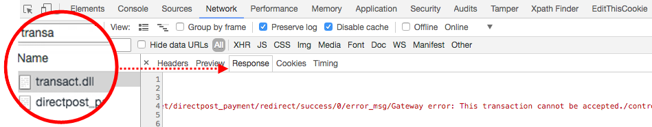

# Erro ao fazer pedido com a conta de sandbox Authorize.net (ocorreu um erro no servidor)

Este artigo fornece uma correção para a mensagem de erro &quot;*Ocorreu um erro no servidor*&quot; ao fazer um pedido usando a Publicação direta do Authorize.Net.

>[!WARNING]
>
>**Aviso de descontinuação**
>
>Devido à Diretiva de Serviço de Pagamento [PSD2](https://experienceleague.adobe.com/en/docs/commerce-admin/start/compliance/payments/compliance-payment-services-directive) e à evolução contínua de muitas APIs, o Authorize.Net corre o risco de se tornar desatualizado e não estar mais em conformidade com a segurança no futuro. Por esse motivo, ela agora está obsoleta, e recomendamos que você a desative na configuração do Adobe Commerce e faça a transição para a [extensão de Commerce Marketplace](https://marketplace.magento.com/extensions.html) correspondente.
>
>**Esta integração foi removida da versão 2.4.0 do Adobe Commerce e foi descontinuada das versões atuais 2.3.**
>
>Para obter detalhes sobre como fazer uma transição segura de integrações de pagamento obsoletas, consulte nosso [DevBlog](https://community.magento.com/t5/Magento-DevBlog/Deprecation-of-Magento-core-payment-integrations/ba-p/426445).

## Problema

Fazer um pedido usando a conta de sandbox [Authorize.Net Direct Post](https://experienceleague.adobe.com/en/docs/commerce-knowledge-base/kb/troubleshooting/payments/error-placing-order-with-authorize-net-sandbox-account-an-error-occurred-on-the-server) causa uma mensagem de erro:

&#x200B;>>
&quot;Erro no servidor. Tente fazer o pedido novamente&quot;

## Causa 1: o Modo de Teste está habilitado

Não parece óbvio, mas a configuração **Modo de Teste** do Authorize.net deve ser definida como **Não** mesmo durante os testes com a conta de Sandbox.

## Solução 1: desative o modo de teste

1. Vá para **Lojas** > **Configuração** > **Vendas** > **Métodos de Pagamento** > **Outros Métodos de Pagamento** > **Authorize.net Publicação Direta**.
1. Defina **Modo de Teste** como &quot;Não&quot; (desmarque **Usar valor do sistema** e selecione &quot;Não&quot; no menu).
1. Clique em **Salvar configuração**.

## Causa 2: URLs incorretos

As configurações do Authorize.net podem conter endereços de URL incorretos para os recursos críticos do Authorize.Net.

## Solução 2: forneça os URLs corretos

* **URL do Gateway:**   `https://test.authorize.net/gateway/transact.dll`
* **URL de Detalhes da Transação:**   `https://apitest.authorize.net/xml/v1/request.api`
* **Referência da API:**   `https://developer.authorize.net/api/reference/`

## Se nada ajudou: obter informações de depuração

Se ao fazer um pedido com Authorize.net falhar com um erro não informativo *&quot;Algo deu errado&quot;*, verifique o Adobe Commerce `debug.log`.

### Transact.dll

Caso o `debug.log` esteja vazio, verifique a resposta do **transact.dll** no console do navegador:

1. Abra o console.
1. Antes de fazer um pedido, vá para a guia **Rede** e selecione **Preservar log**.    
1. Filtre as respostas por **transact.dll** para ver uma mensagem de resposta com um possível erro.    
