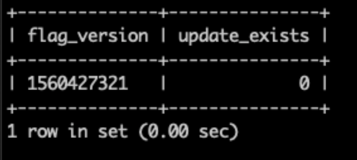

# Erro 404 em todas as páginas devido ao problema de preparo de conteúdo

Este artigo fornece uma correção para o problema do Adobe Commerce no local e do Adobe Commerce na infraestrutura de nuvem, em que você recebe um erro 404 ao acessar qualquer página da loja ou o [!UICONTROL Commerce Admin].

## Produtos e versões afetados

* Adobe Commerce no local 2.2.x, 2.3.x
* Adobe Commerce na infraestrutura em nuvem 2.2.x, 2.3.x

## Problema

>[!NOTE]
>
>Este artigo não se aplica à situação em que você recebe um erro 404 ao tentar [visualizar a atualização de preparo](https://experienceleague.adobe.com/pt-br/docs/commerce-admin/content-design/guide-overview#preview-the-scheduled-change). Se você tiver esse problema, abra um [tíquete de suporte](https://experienceleague.adobe.com/pt-br/docs/commerce-knowledge-base/kb/help-center-guide/magento-help-center-user-guide#support-case).

O acesso a qualquer página da loja ou ao Administrador resulta no erro 404 (a página &quot;Ops, nossas más...&quot;) após executar operações com atualizações agendadas para ativos de conteúdo de loja usando [Armazenamento temporário](https://experienceleague.adobe.com/docs/commerce-admin/content-design/staging/content-staging.html?lang=pt-BR) (atualizações para ativos de conteúdo de loja agendadas usando o [módulo Magento\_Armazenamento temporário](https://developer.adobe.com/commerce/php/module-reference/)). Por exemplo, você pode ter excluído um Produto com uma atualização programada ou removido a data final da atualização programada.

Um ativo de conteúdo de armazenamento inclui:

* Produto
* Categoria
* Regra de preço de catálogo
* Regra de preço do carrinho
* Página do CMS
* Bloco do CMS
* Widget

Alguns cenários são discutidos na seção Causa abaixo.

## Causa

A tabela `flag` no banco de dados contém links inválidos para a tabela `staging_update`.

O problema está relacionado ao preparo de conteúdo. Abaixo estão dois cenários específicos; observe que pode haver mais situações que acionam o problema.

**Cenário 1:** exclusão de um ativo de conteúdo de repositório que:

* tem uma atualização agendada com o Preparo de conteúdo
* a atualização tem uma data final (ou seja, a data de expiração após a qual o ativo atualizado reverte para a versão anterior)
* a data final da atualização está no passado

Ao mesmo tempo, o problema pode não ocorrer se um ativo excluído não tiver uma data final para a atualização agendada.

**Cenário 2:** Removendo a data/hora final de uma atualização agendada.

### Identificar se o problema está relacionado

Para identificar se o problema que você está enfrentando é o descrito neste artigo, execute a seguinte consulta de BD:

```sql
   SELECT f.flag_data >'$.current_version' as flag_version, (su.id IS NOT NULL) as update_exists
   -> FROM flag f
   -> LEFT JOIN staging_update su
   -> ON su.id = f.flag_data >'$.current_version'
   -> WHERE flag_code = 'staging';
```

Se a consulta retornar uma tabela em que o valor `update_exists` é &quot;0&quot;, então existe um link inválido para a tabela `staging_update` em seu banco de dados, e as etapas descritas na [seção Solução](#solution) ajudarão a resolver o problema. Este é um exemplo do resultado da consulta com o valor `update_exists` igual a &quot;0&quot;:



Se a consulta retornar uma tabela em que o valor `update_exists` é &quot;1&quot; ou um resultado vazio, significa que o problema não está relacionado às atualizações de preparo. Este é um exemplo do resultado da consulta com o valor `update_exists` igual a &quot;1&quot;:


Nesse caso, você pode consultar o [Solucionador de Problemas de Site Inativo](https://experienceleague.adobe.com/pt-br/docs/commerce-knowledge-base/kb/troubleshooting/site-down-or-unresponsive/magento-site-down-troubleshooter) para obter ideias de solução de problemas.

## Solução

1. Execute a seguinte consulta para excluir o link inválido para a tabela `staging_update`:

   ```sql
   DELETE FROM flag WHERE flag_code = 'staging';
   ```

1. Aguarde até que o trabalho [!DNL cron] seja executado (executado em até cinco minutos se configurado corretamente) ou execute-o manualmente se você não tiver o [!DNL cron] configurado.

O problema deve ser resolvido logo após a correção do link inválido. Se o problema persistir, [envie um tíquete de suporte](https://experienceleague.adobe.com/pt-br/docs/commerce-knowledge-base/kb/help-center-guide/magento-help-center-user-guide#support-case).

## Leitura relacionada

[Práticas recomendadas para modificar tabelas de banco de dados](https://experienceleague.adobe.com/pt-br/docs/commerce-operations/implementation-playbook/best-practices/development/modifying-core-and-third-party-tables#why-adobe-recommends-avoiding-modifications) no Manual de implementação do Commerce
